CSP is a browser security mechanism that aims to mitigate XSS and some other attacks. It works by restricting the resources (such as scripts and images) that a page can load and restricting whether a page can be framed by other pages.

To enable CSP, a response needs to include an HTTP response header called Content-Security-Policy with a value containing the policy. The policy itself consists of one or more directives, separated by semicolons. 

https://portswigger.net/web-security/cross-site-scripting/content-security-policy

**Low:**

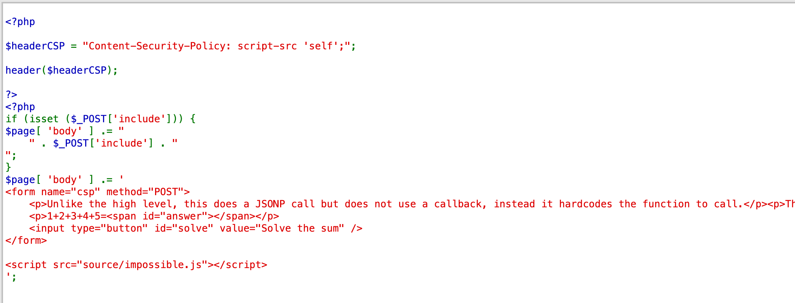

- https://digi.ninja/dvwa/alert.js
- https://digi.ninja/dvwa/alert.txt
- https://digi.ninja/dvwa/cookie.js
- https://digi.ninja/dvwa/forced_download.js
- https://digi.ninja/dvwa/wrong_content_type.js

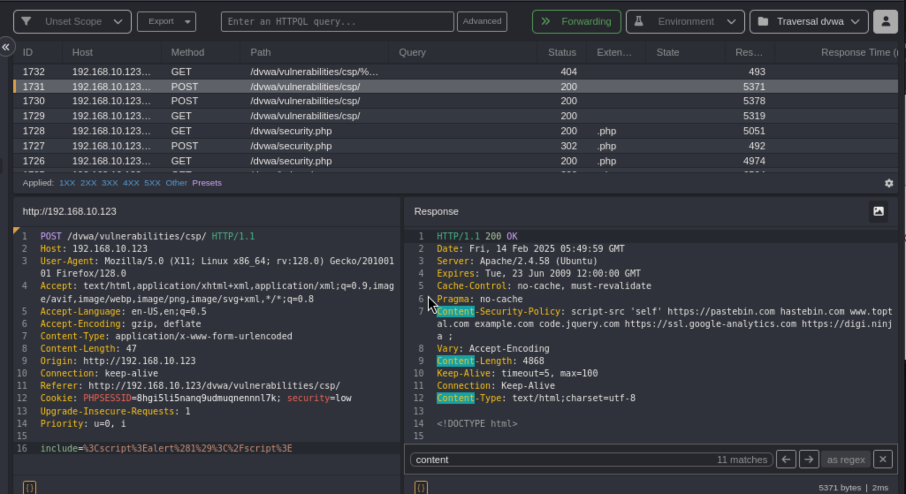

Pretend these are on a server like Pastebin and try to work out why some work and some do not work. Check the help for an explanation if you get stuck.

If incorrectly implemented it can lead to CSP vulnerabilities.

The first one works

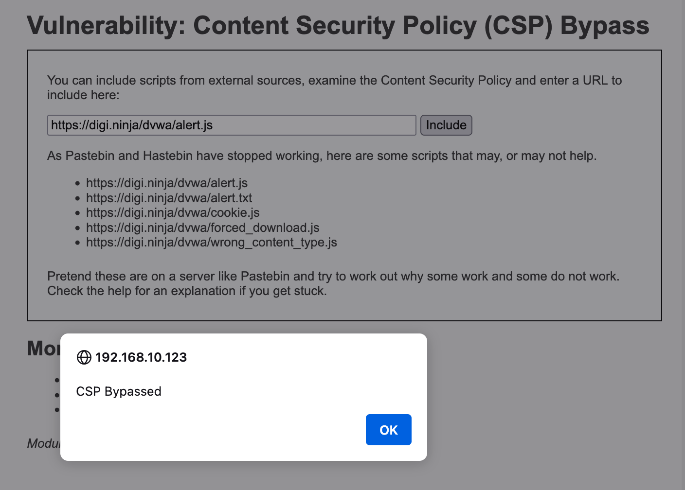

The second in the list didn't seem to work
	This one is a txt file

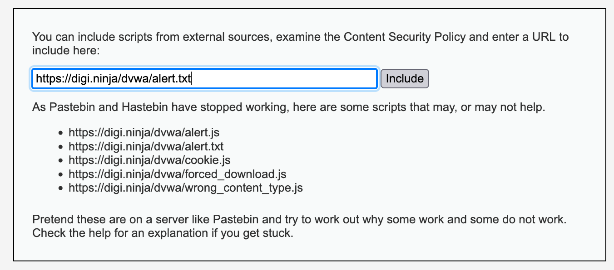

https://digi.ninja/dvwa/cookie.js

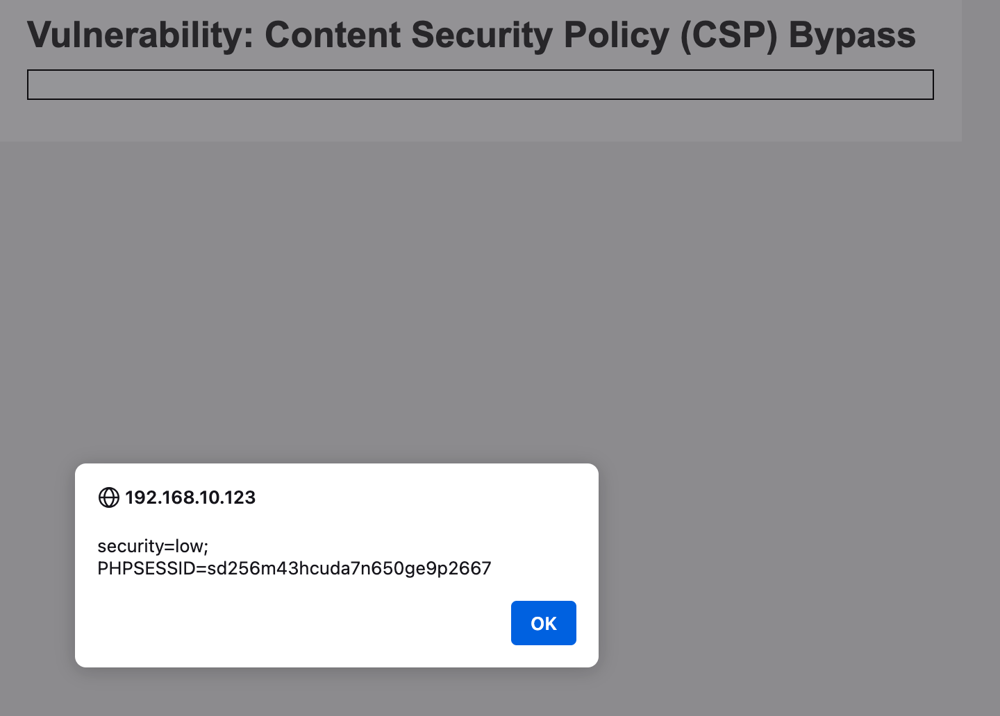

This one obviously worked

Nothing seemed to happen for this one.

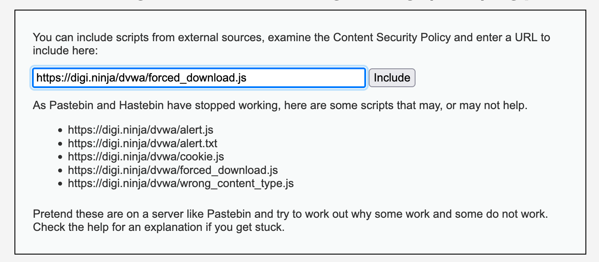

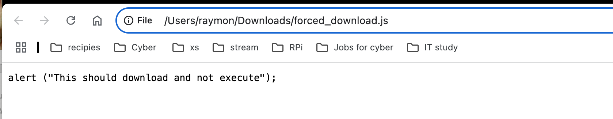

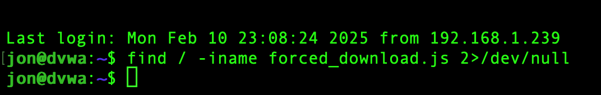

This one puzzled me, I tried to find the file on the server but found nothing. 

This next one also didn't download or execute 

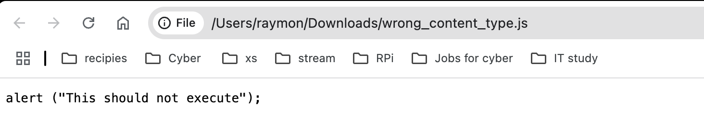

Results: 

`alert.js` - Will work, this is a normal JavaScript file served with the correct headers.

`alert.txt` - This will not work as it has the wrong content type set by the web server due to its file extension.

`cookie.js` - This will work and will show your cookies

`forced_download.js` - As the name says, the server sets the "Content-Disposition: attachment" header for this to force the browser to download it rather than execute it.

`wrong_content_type.js` - This will not work as the web server ignores the file extension and forces the content type to get set as "plain/text" which prevents the browser executing it.

I tried to get the content_download.js file to download with no luck
Attempts were made on my firefox(macos), firefox(kali), chromium(kali), all failed. If you go to the url you will be forced to download.

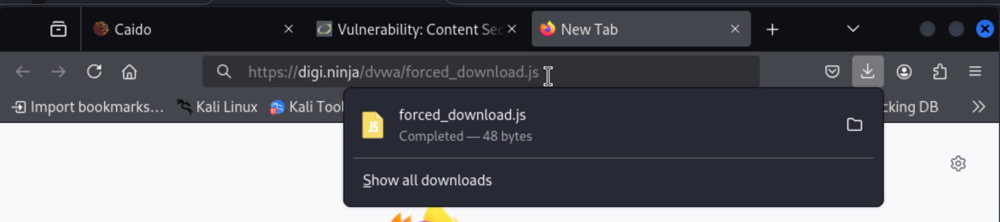

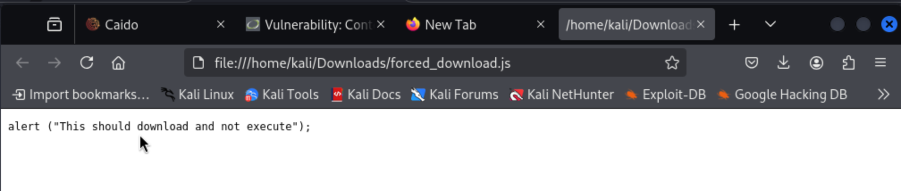

We can create a file with `alert(1)` and upload it into the database using the file uploads tab. Then we enter the file path as the url

`http://192.168.10.123/dvwa/uploads/2csp`

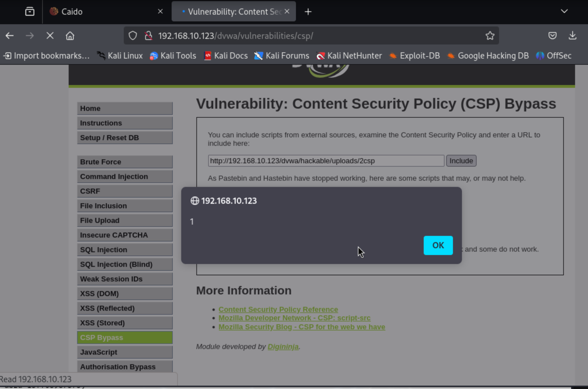

**Medium**

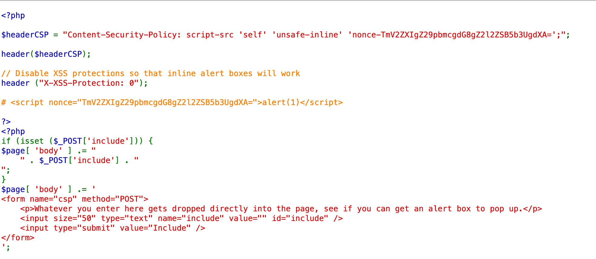

``
 
They're showing us how to bypass the mitigation. 
 
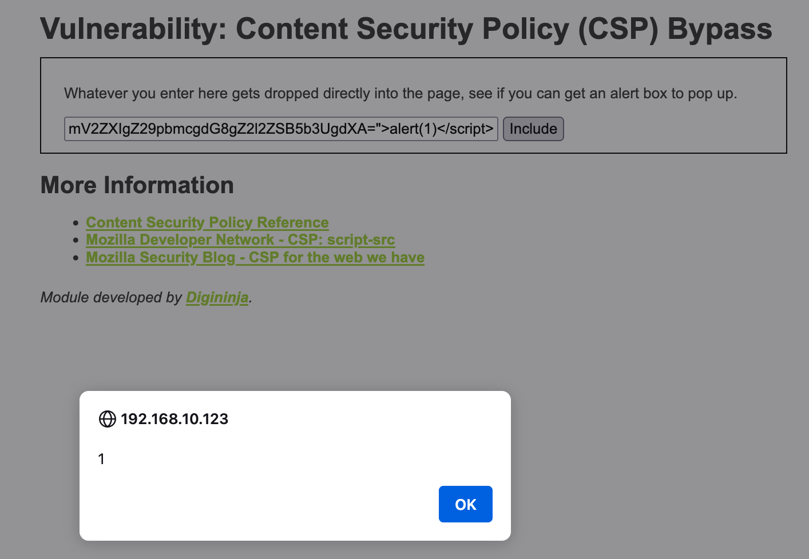

Not sure why I didn't need the url in the one above

https://rentry.co/xsdasdasd

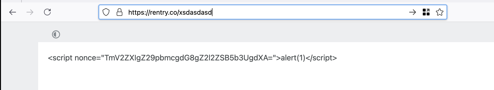

**High**

Simply replace the "solve sum"  JS code with the desired JS and you will get a favourable response.

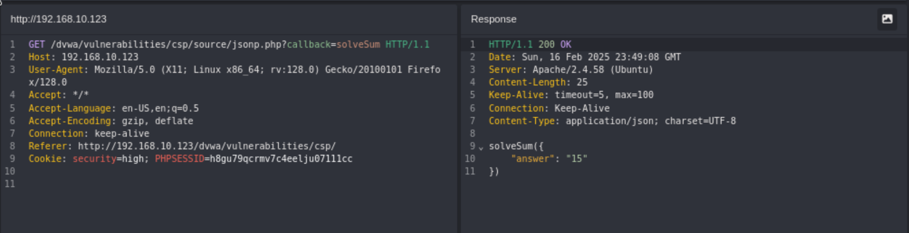

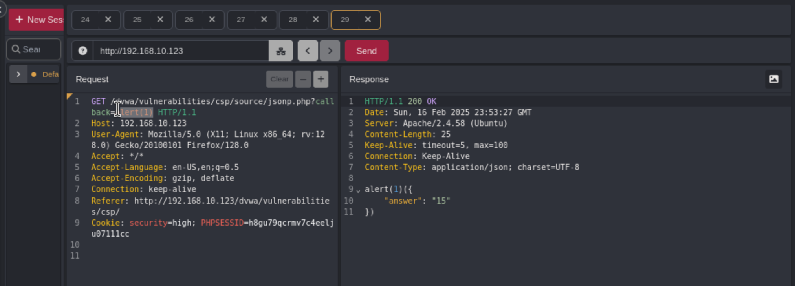

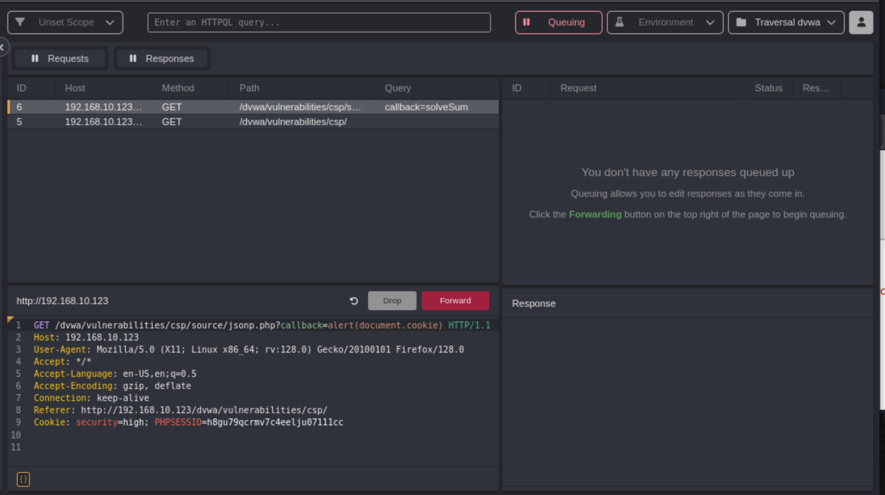

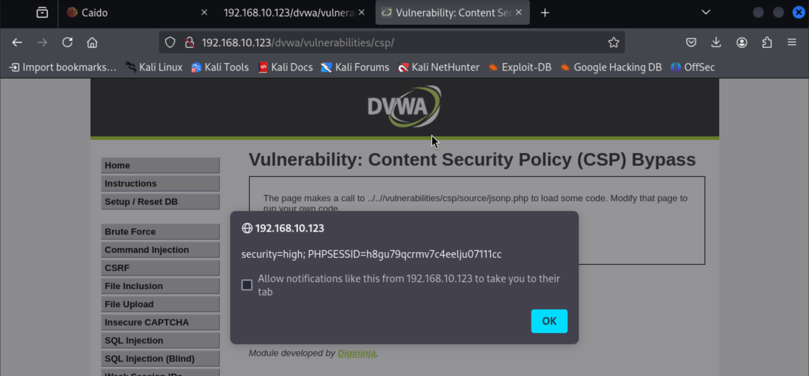