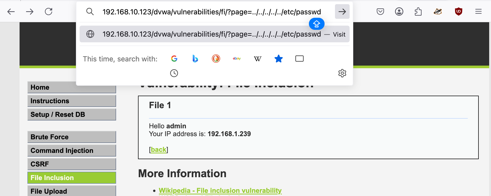
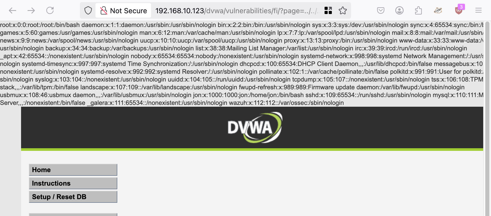

A path traversal attack (also known as directory traversal) aims to access files and directories that are stored outside the web root folder. By manipulating variables that reference files with “dot-dot-slash (../)” sequences and its variations or by using absolute file paths, it may be possible to access arbitrary files and directories stored on file system including application source code or configuration and critical system files. It should be noted that access to files is limited by system operational access control (such as in the case of locked or in-use files on the Microsoft Windows operating system).

This attack is also known as “dot-dot-slash”, “directory traversal”, “directory climbing” and “backtracking”.

https://owasp.org/www-community/attacks/Path_Traversal

`192.168.10.123/dvwa/vulnerabilities/fi/?page=../../../../../etc/passwd`

`curl http://192.168.50.16/cgi-bin/%2e%2e/%2e%2e/%2e%2e/%2e%2e/etc/passwd`

