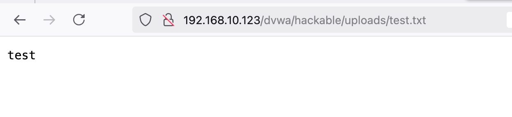
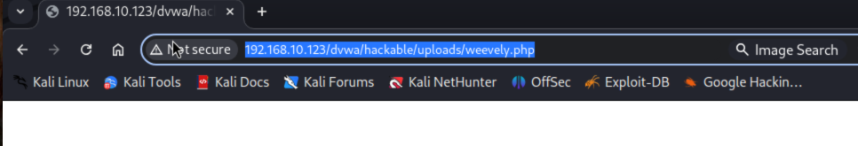
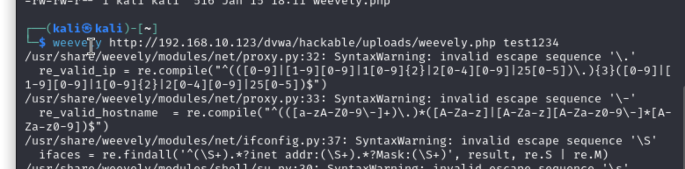

 File upload vulnerabilities are when a web server allows users to upload files to its filesystem without sufficiently validating things like their name, type, contents, or size. Failing to properly enforce restrictions on these could mean that even a basic image upload function can be used to upload arbitrary and potentially dangerous files instead. This could even include server-side script files that enable remote code execution.

In some cases, the act of uploading the file is in itself enough to cause damage. Other attacks may involve a follow-up HTTP request for the file, typically to trigger its execution by the server. 

Portswigger: https://portswigger.net/web-security/file-upload

Low:



First I created a file to upload.


In kali I used weevely
```
weevely generate password weevely.php
```








The above one was wrong because the payload needed to be set to "php/meterpreter/reverse_tcp"


Medium:
When using the medium level, it will check the reported file type from the client when its being uploaded.

Could be that file extension is being checked, or the content


To successfully upload the php file we needed to change the content-type to: image/jpeg using repeater in burpsuite or Caido


High:

We need to change the file signature type using the hexeditor. 
The first 8 characters need to match the png file signature. 

Vi into your malicious file and add 8 spaces on a new line at the start of the file.

When you open the file in hex editor it should look like this:


It should look like this:


Maybe this will work:
download a jpg image and take the script from your exploit file created by msfvenom and add it to the metadata for the image

exiftool -DocumentName'{big long string}' hacker.jpg


Nope, didn't work. Fun though.


Also didnt work: 

- Create key pair
- name the file.pub > authorized_keys
- upload it to the uploads folder 
- using burp or caido, change the file up relative path {../../../../../../../root/.ssh/authorized_keys}

