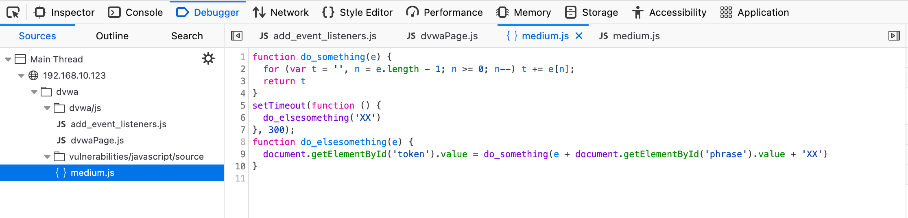

JavaScript is the world's most popular programming langauge. Its prevalence, along with its client-side execution, creates opportunities for various attack vectors. JavaScript to identify and exploit vulnerabilities in web applications, such as Cross-Site Scripting (XSS), Cross-Site Request Forgery (CSRF), and some mention of other common security flaws. 

https://www.stationx.net/javascript-for-hacking/

**Low:**

To make the token visible remove the "hidden" value. 

This explains for to complete the task. Submit the word success and the correct token. 

The token is a rot13 and md5 hash of: 
`'success' = fhpprff = 38581812b435834ebf84ebcc2c6424d6`

Step by step:
- Open inspector and change the token type from "hidden" to ""
- Rot13 then md5 the work 'success'
- Enter the work success in the 'phase' field and the token in the 'token' field. 
	

We can also use the console:

As you can see the generate_token function has created and filed the token field based on the word in the 'Phrase' field. 

Debugging:

**Medium:**

Help - The JavaScript has been broken out into its own file and then minimized. You need to view the source for the included file and then work out what it is doing. Both Firefox and Chrome have a Pretty Print feature which attempts to reverse the compression and display code in a readable way.

Looks like there are 2 functions taking manipulating the 'phrase'
	
	do_something 
		Takes the string into the variable 'e', and iterates the string in reverse to the variable 't'
	do_somethingelse
		Takes a string, appends the "phrase" element's value and "XX" to it, reverses the whole thing, and puts the result in the "token" element.

Ctrl + b will set a breakpoint and then use the step in button or F11 to iterate through and follow the function.  

Keep hitting the step in and you'll reveal what the function is doing to the 'phrase' field

