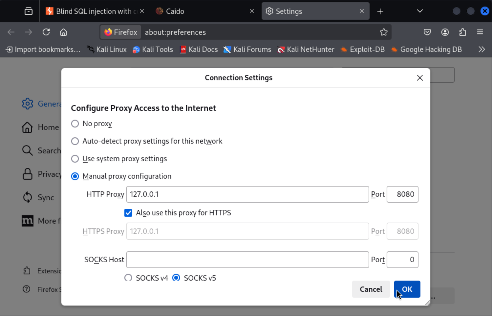
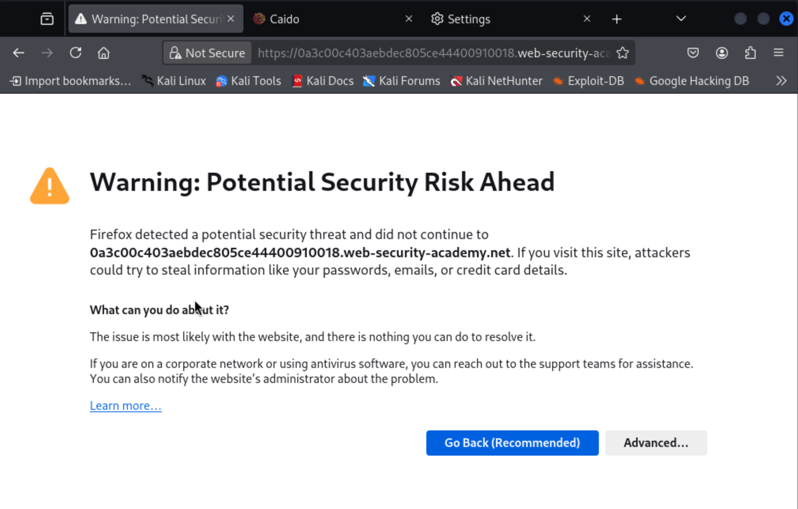
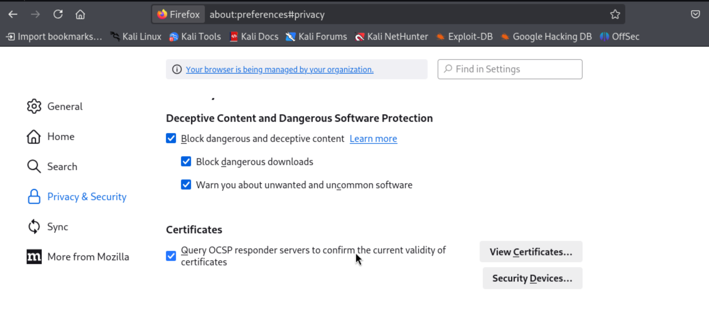
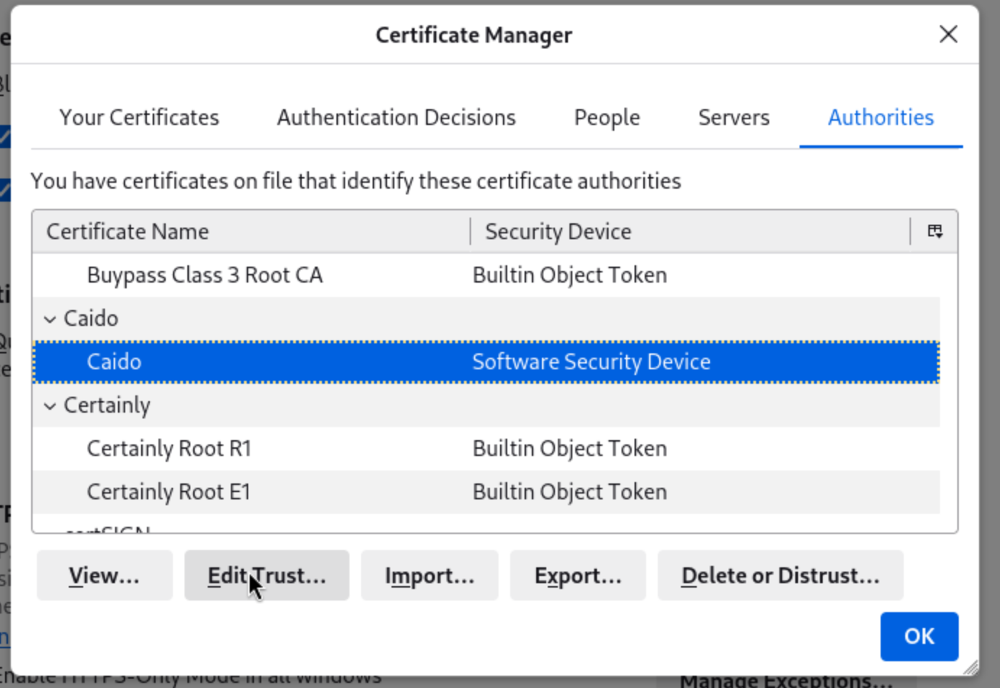

Use the following guide to install the package:  
https://docs.caido.io/guides/#installing-on-linux

Once you've installed Caido in Kali and you have used it in your on your self hosted website. But, you get a certificate error when you go to a lab on Portswigger.

  


When you installed Caido you have been prompted to set up a proxy server in the network settings in firefox.  

As part of the install a certificate should have been added to your 'trusted certificates'. This is fine to use for local machines eg.127.0.01.  
Go into the certificate and tick the box that allows firefox to trust it.

Firefox url:  
```
about:preferences#privacy
```



Click on View Certificates:  
 Authorities tab:  
  Caido:  
   Edit Trust button:

  


Now start Caido using by typing: ```caido```  into the terminal

