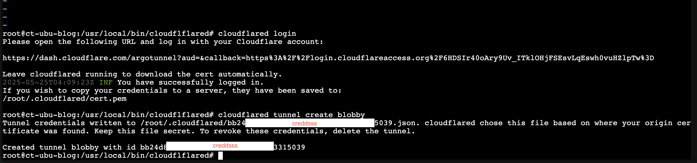
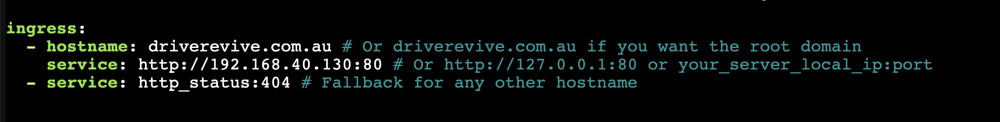
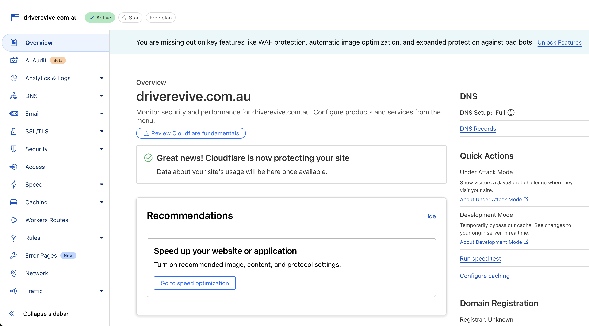
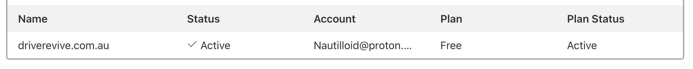
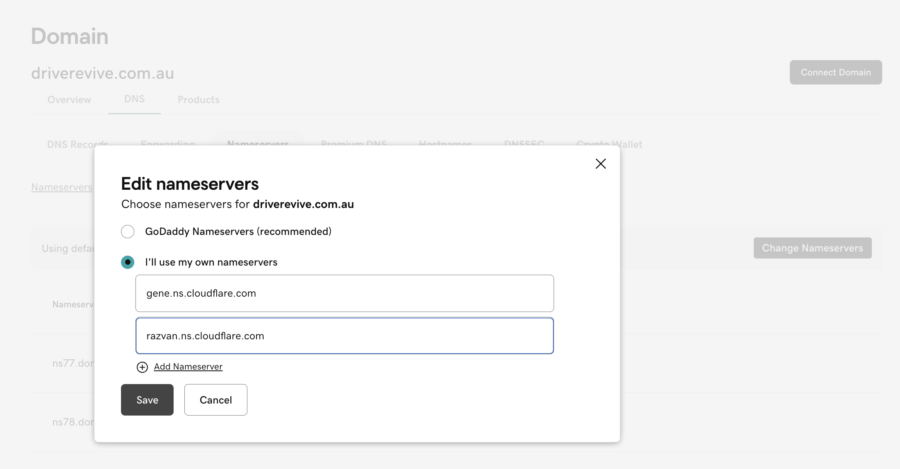

Okay so exposing ports and having ISP's fucking with your connection and intermittently bringing your site down is particularly annoying. Here is the fix to negate their CGNATs

This provides a little info and some alternative solutions.
https://www.whistleout.com.au/Broadband/Guides/what-is-CGNAT-and-how-to-opt-out


Using a cloudflare tunnel we can authorise a tunnel directly between your server and the cloudflare exit node. This free service provides powerful features and free security protections. 

https://developers.cloudflare.com/cloudflare-one/connections/connect-networks/

----
First you'll need to set up a free account with cloudflare at:
```cloudflare.com/en-au/```

Download and install 'cloudflared' onto your ubuntu server 
```
wget https://github.com/cloudflare/cloudflared/releases/latest/download/cloudflared-linux-amd64

dpkg -i cloudflared-linux-amd64.deb
```

```
mv cloudflared-linux-amd64 /usr/local/bin/cloudflared
chmod +x /usr/local/bin/cloudflared
```

Once you installed the pack run this:
```cloudflared login```

You'll be prompted authorise this in your Cloudflare dash so its good to be logged into it. 

```cloudflared tunnel create your-tunnel-name-here```



The command will output the tunnel's **UUID** (a long alphanumeric string) and the path to its **credentials file** (e.g., `~/.cloudflared/<UUID>.json`). **Copy both the UUID and the full path to the credentials file.** You'll need these later.

You need to tell Cloudflare how to route traffic coming through your tunnel to your local web server. This is done via a configuration file.

```
mkdir ~/.cloudflared/
vim ~/.cloudflared/config.yml
```

update the config file.

```
tunnel: your-tunnel-name
credentials-file: /root/.cloudflared/your-creds-file.json

ingress:
  - hostname: your-site.com
  - service: http://localhost:80
  - service: http_status:404
```



Create DNS record 

```
cloudflared tunnel route dns bloggy blog.driverevive.com.au
```
```
cloudflared tunnel run name-of-tunnel

```
This creates the tunnel without needing to open ports.

----

Now start the service.

```
cloudflared service install
```

Open your hosting provider portal/dash e.g GoDaddy.com and the cloudflare dash.





Input the nameserver details from cloudflare into the hosting provided.




Its worth having a look through the Cloudflare portal. 