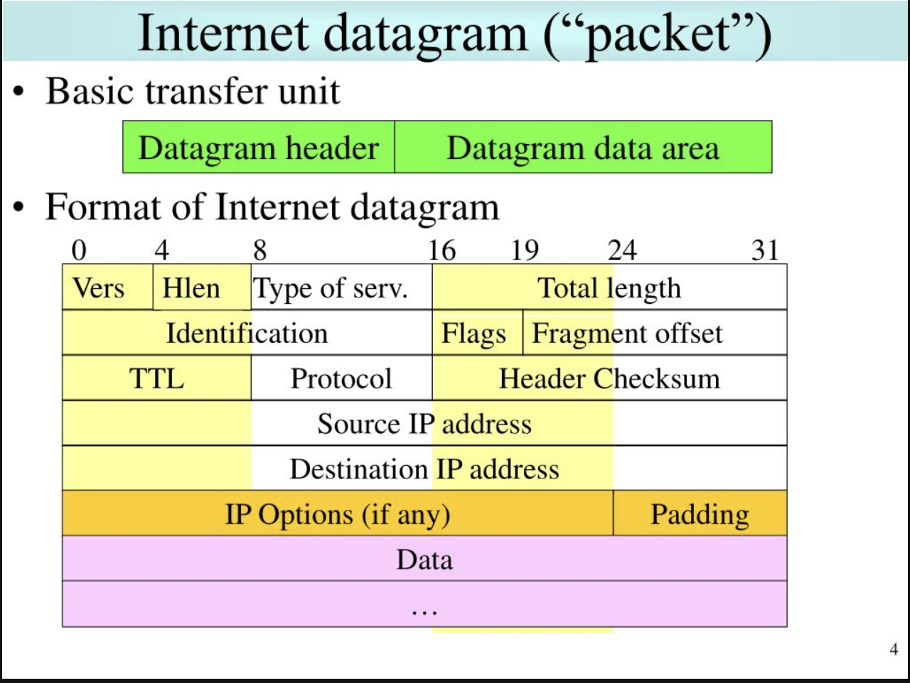

First, some background



https://www.rfc-editor.org/rfc/rfc791

Steve Gibson GRC explains the Internet
https://www.youtube.com/watch?v=7ALMh6I1fAo

 The model of operation is that an internet module resides in each host
  engaged in internet communication and in each gateway that
  interconnects networks.  These modules share common rules for
  interpreting address fields and for fragmenting and assembling
  internet datagrams.  In addition, these modules (especially in
  gateways) have procedures for making routing decisions and other
  functions. -rfc791-

 The datagram arrives at a gateway host wrapped in the local network
header, the local network interface strips off this header, and turns the datagram over to the internet module.  The internet module determines from the internet address that the datagram is to be forwarded to another host in a second network.  The internet module determines a local net address for the destination host.  It calls on the local network interface for that network to send the datagram. -rfc791-

- This "stripping" of the header means: Once the address has been found from the header in the frame. The information/data is handed to the next layer to be read. This is "stripped" or "unwrapped" but simply put the location of the binary in the packet is read depending on its location in the pack


Fragmentation of an internet datagram is necessary when it originates in a local net that allows large packet size and must traverse a local net that limits packets to a smaller size to reach its destination.

?? Could you reorder the packet to avoid detection ??

**IPv4 Alternative Representation**

Uniform Resource Identifier (URI): Generic Syntax
https://www.rfc-editor.org/rfc/rfc3986


```curl -v https://0x8.0X8.010.8```


```curl -v https://0x8.0010.010.8```

https://dominicbreuker.com/post/filters_bypasses_rare_ipv4_formats_for_ssrf/
https://dominicbreuker.com/encoders/#ipv4-addresses


Tool for converting IP's
https://github.com/GxbNt/IPConverter/blob/main/README.md


I've been told there is a way to force the CIDR range to divide by 2 if its over 255 but I can't find and research on it..... yet. 

