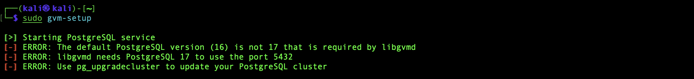
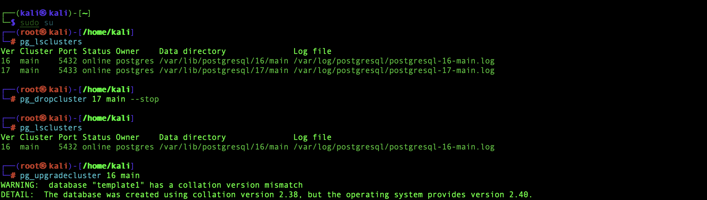
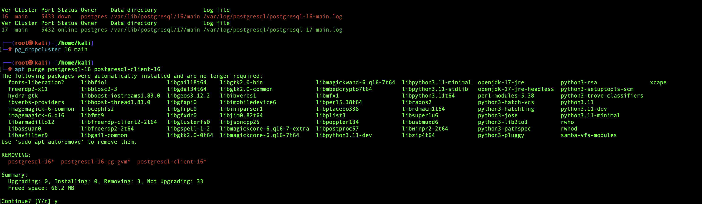
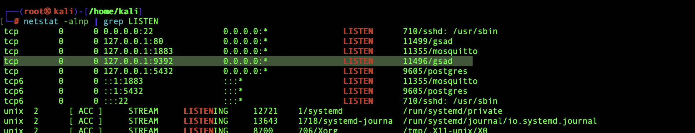
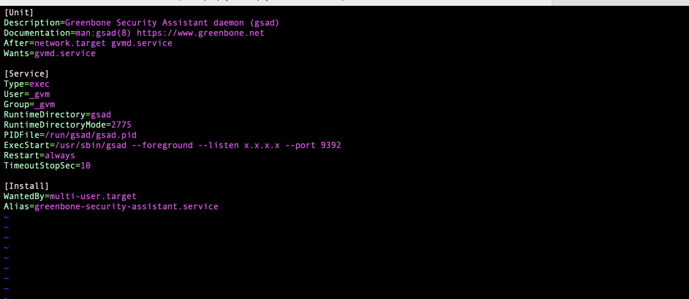

Installing OpenVAS on Kali for free vulnerability scanner

Follow the instructions in this link:

https://greenbone.github.io/docs/latest/22.4/kali/index.html

**Troubleshooting:**

		

Before running the gvm-setup command from the tutorial above you need to upgrade PostgreSQL to version 17

https://secburg.com/posts/howto-upgrade-postgresql-16-to-17/






Add: ``` ExecStart=/usr/sbin/gsad --listen=x.x.x.x --port 9392 ```

To: ```/usr/lib/systemd/system/gsad.service```



```
sudo systemctl daemon-reload && sudo gvm-start
```