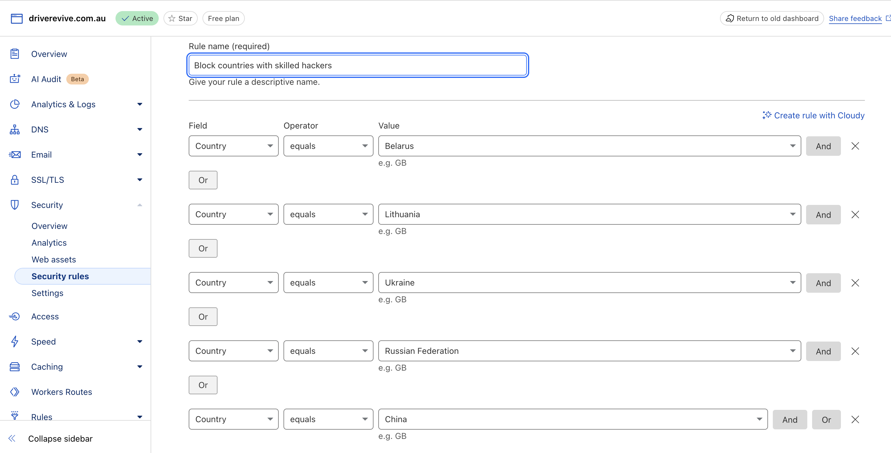
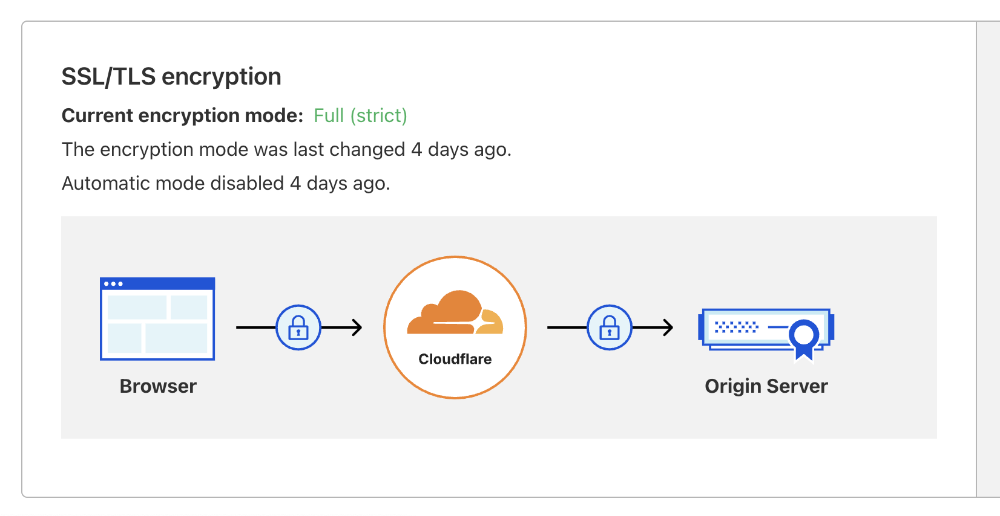
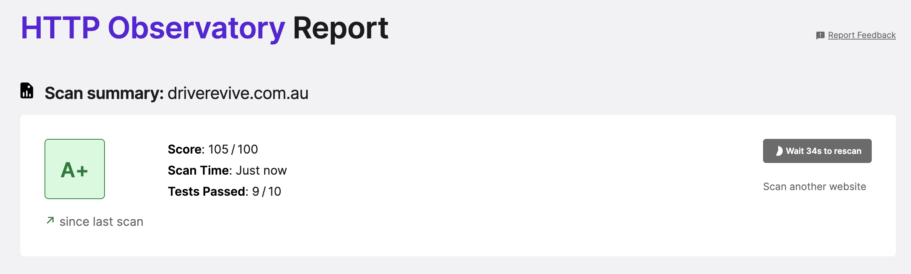
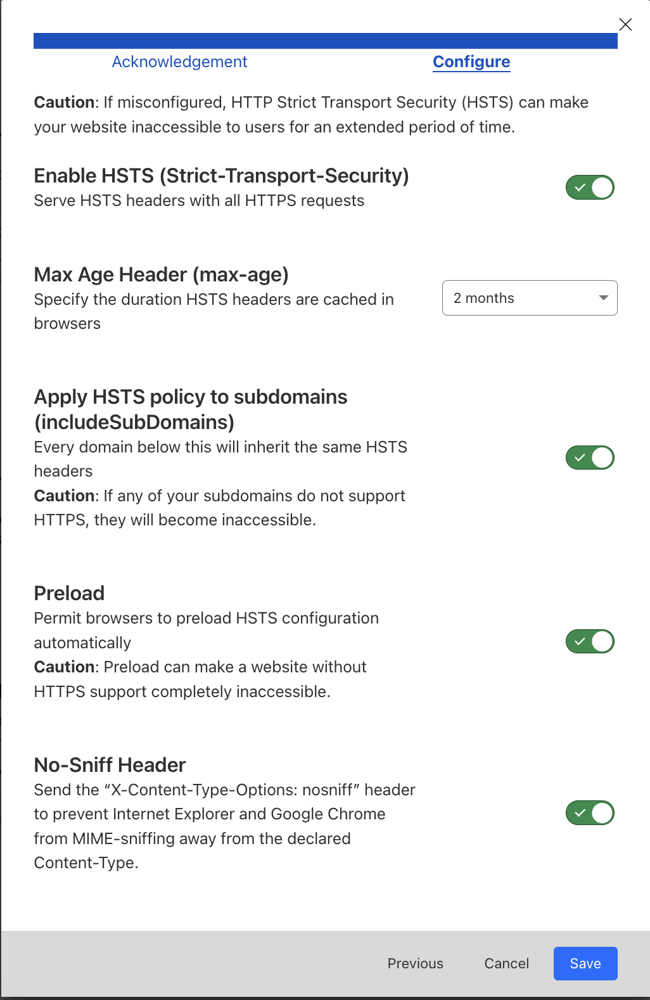
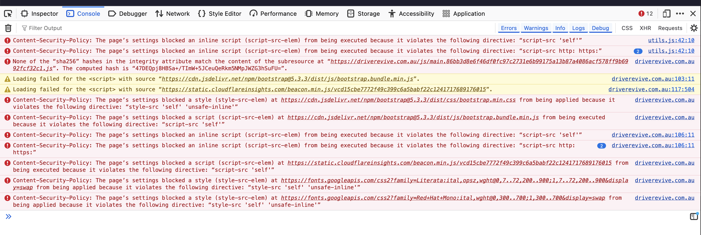
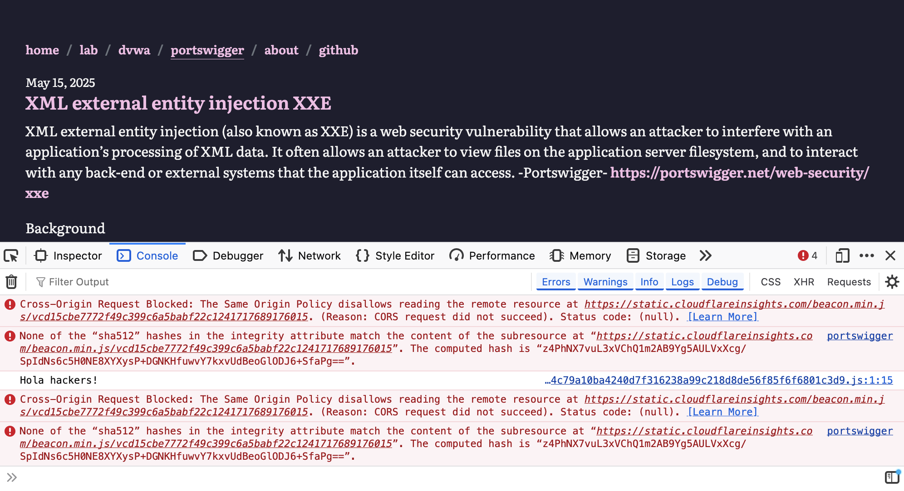
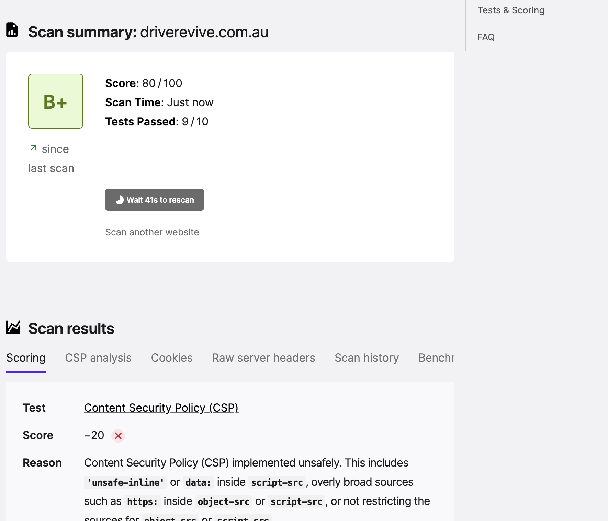
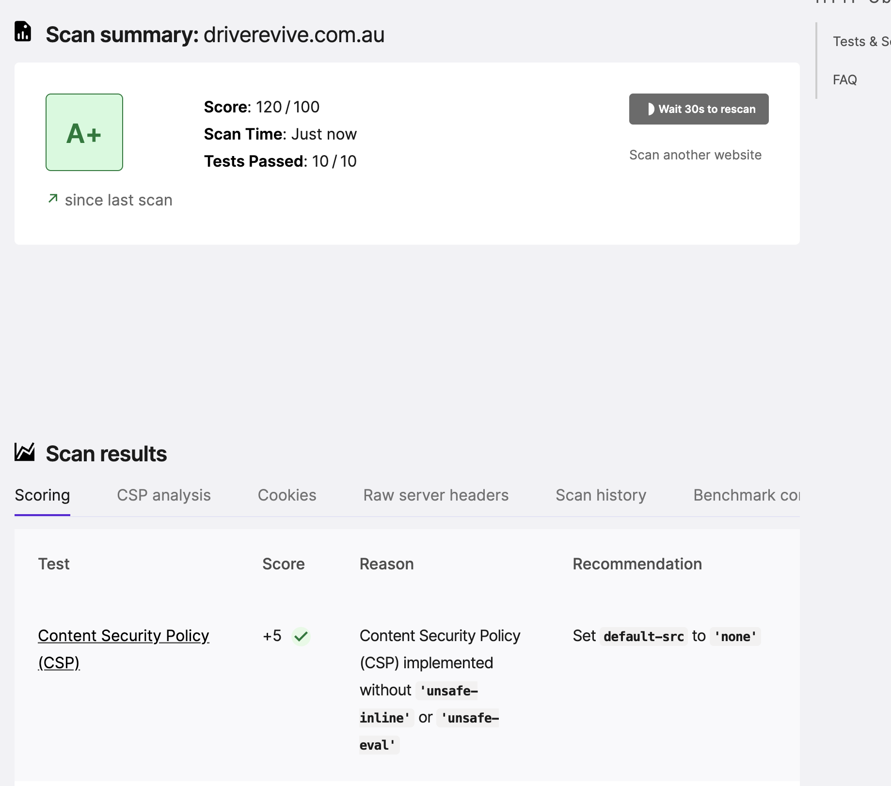
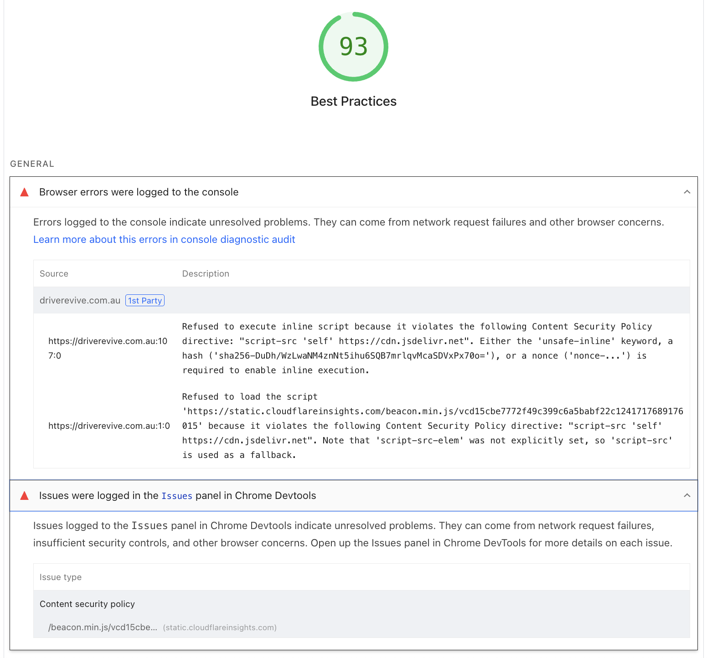
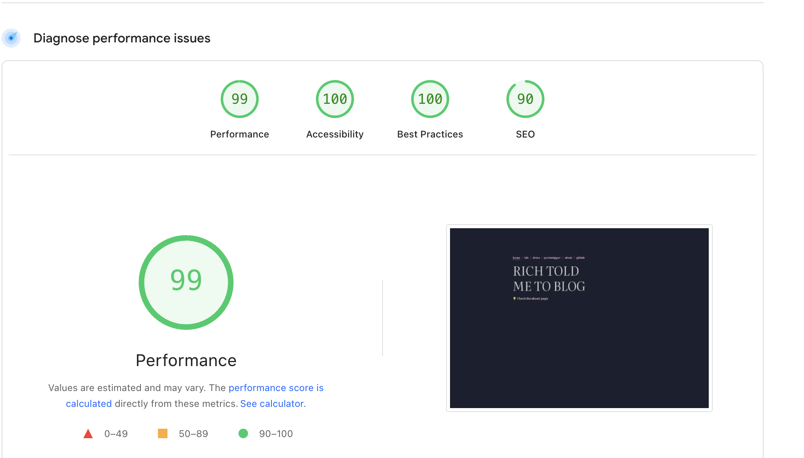

After creating a blog and releasing it into the wild, I instantly became paranoid that my network would be exploited.

I wanted to be sure that I had done everything in my power to secure the site and isolate it from my home network.

Initially, these were the techniques I used to layer security:

- Keep software up to date; automate updates using cron
- Content Security Policies
- Fail2ban (unnecessary, as SSH is disabled, but good to know about)
- UFW
- Isolated VLAN/DMZ
- HTTP redirected to HTTPS
- SSH disabled

With all of this done, I was still very paranoid because my public IP was exposed. Knowing what's crawling around out there, I was quite uncomfortable. My site was also intermittently down every 5 minutes—my ISP (98% sure) is using CGNAT, and self-hosting breaks their terms of service agreement.

To further improve my site's security, I decided to use a Cloudflare tunnel to hide my IP address. With this free service, I can also:

- Enable 'Use HTTPS only'
- Enable website analytics
- Run vulnerability scans through the Cloudflare portal
- Block countries
- Enable HSTS
- Set a minimum TLS version









I added the new CSP to `/etc/nginx/sites-available/your-site`.

When I set the CSP, I got some errors as the headers were too rigid and sacrificed functionality for security.



I've altered the policy to allow specific scripts from known URIs. I've removed Cloudflare's analytics because it's still gathering information from the tunnel. But there are still issues with the Subresource Integrity (SRI).

After updating the SRI hashes, I was still getting a few errors.



After working for at least an hour, I realized uBlock was still on!

Still some work to be done.



Used this CSP:  
*Needs to be on the same line for nginx*
```
add_header Content-Security-Policy "default-src 'self'; img-src 'self'; script-src 'self' https://cdn.jsdelivr.net; style-src 'self' https://cdn.jsdelivr.net https://fonts.googleapis.com; font-src 'self' https://fonts.gstatic.com; object-src 'none'; frame-ancestors 'none'; base-uri 'self'; form-action 'self';" always;
```

Now:



------

I went back to google insights and ran another scan. The results were good, but not great. Insights helped me develop a new content-security-policy that fixes some of the terminal error issues. 



```
default-src 'self'; img-src 'self' data:; script-src 'self' https://cdn.jsdelivr.net https://static.cloudflareinsights.com 'sha256-DuDh/WzLwaNM4znNt5ihu6SQB7mrlqvMcaSDVxPx70o='; style-src 'self' 'unsafe-inline' https://cdn.jsdelivr.net https://fonts.googleapis.com; font-src 'self' https://fonts.gstatic.com; object-src 'none'; frame-ancestors 'none'; base-uri 'self'; form-action 'self';
```
Now I believe we are done!


