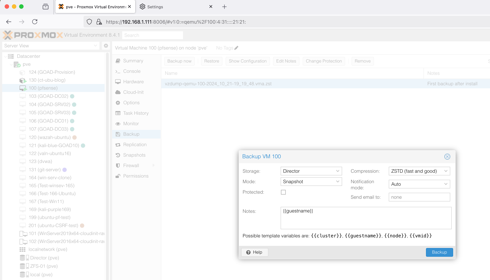
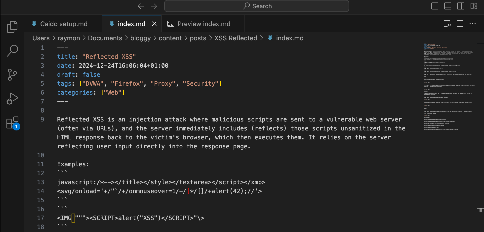
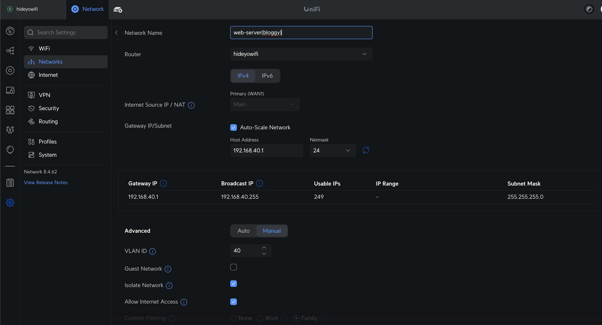
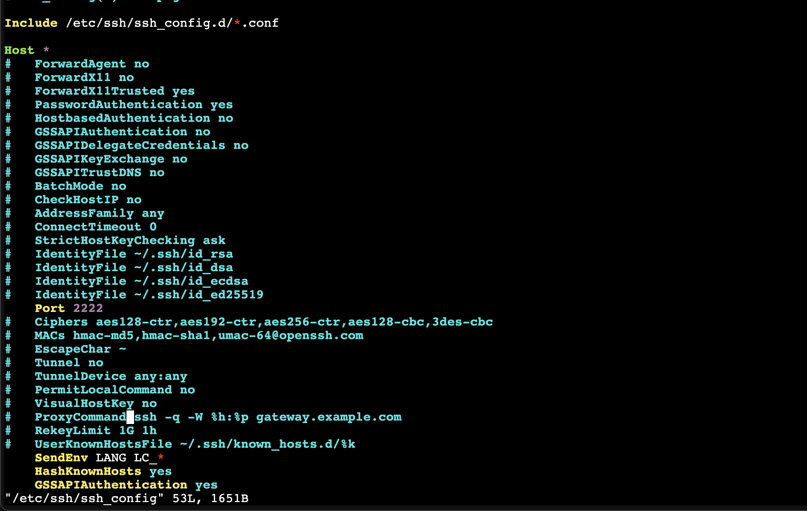

**Technologies**

Ubuntu Server > Nginx > Git > Hugo > Obsidian > Unifi > No-IP > GoDaddy

Note: Before starting this please consider that if you'd like to have screenshots in your blog you need to have a path from your .md file to the location of the .png. To simplify this when I create a markdown file for a blog post, I first create a folder that will hold all of the content. I wish I'd know to do this from the start.


---
**Ubuntu LXC** 

Create a new Ubuntu LXC in your Hypervisor. 

I gave my container the IP address: 192.168.40.130, machine number:130, machine name: ct-ubu-blog

This way I can easily find it later when I want to add firewall rules and use the routers DMZ

---
**Nginx**

Once you have the CT setup, login and update.

```
apt update && apt upgrade -y
apt install -y nginx git
systemctl start nginx
systemctl enable nginx
cd /var/www/
```

---
**Hugo**

When installing Hugo from the apt repository I found that I would install an old version that was incompatible with certain themes. I initially used apt install hugo but then upgraded b using the following: 

Find the latest releases here: https://github.com/gohugoio/hugo/releases
Because I have an ubuntu container in proxmox running on x86 architecture, I downloaded the hugo_0.145.0_linux-amd64.deb file. The version will most likely be out of date but the commands the same.

```
wget https://github.com/gohugoio/hugo/releases/download/v0.145.0/hugo_0.145.0_linux-amd64.deb
dpkg -i hugo_0.145.0_linux-amd64.deb
hugo version
```

Choose a theme from here: https://themes.gohugo.io/ 

On this occasion I chose not-much
https://github.com/imgios/not-much/tree/main
Read the README.md first: https://github.com/imgios/not-much/blob/main/README.md

**Important lessons**
- Structure you .md files the right way from the start to make them clean and clean
- Inserting images is easy if you know how from the beginning. 
- Understand the difference between a list and single pages. 
- Straying from the theme page structure is difficult, documentation and AI was helpfull
- Understand `Front Matter` in the index.md and _index.md files
- Sometimes its pertinent to rebuild the entire site using the --disableFastRender option
- If you're using a remote headless server use the bind option
 
```hugo server --disableFastRender  --bind 192.168.40.130 --baseURL http://192.168.40.130  -D```

This command will host a server on your server IP(192.168.1.130), port 1313. It will render the page from scratch and show any draft posts.  

Lets begin: 

Make sure you're in your blog folder /var/www/
```
hugo new site bloggy
cd bloggy/
git init
git pull https://github.com/imgios/not-much.git themes/not-much

```

Add this to the hugo.toml file 
```
theme = 'not-much'
```

Take a look through the README.md . It should show you some of the layout options. I used the example they offered but its pretty easy to change the colour schemes. 


Copy the contents of the themes/not-much/examplesite/config.toml file and put it in the hugo.toml file in your blogs root directory. That gave me the look and feel of the site. 

These was some messing about with the hugo.toml file and the layout/<new folder>/list.html files in order to change the menu/list options.


---

**Backup**

Maybe, just maybe, this would be a good time to backup the container. Brilliant idea if you think you might fuck up, which I did multiple times. 



---
**File Structure and Images** 

It's extremely important to understand this before going to far. In the Obsidian section below I explain how to manage this file system.

---
**Git**

Version control is important. Git is a solution that integrates well with other applications. You'll need to input your github account details. If you don't have one, create and account and do some online tutorials.
While in the your blog root directory, run the following commands.
```
git init
git config --global user.name "your_git_username"
git config --global user.email "your_email@email.com"
```

Make a test file test.txt with some text and did a git add/commit

```git add .``` This will add all changes to the commit list

```git commit -m "test"``` Commits to the current branch, -m will add a comment.


Then I push test.txt file to github.
```
git push origin main
```

You will be prompted for a username AND password. 

The password being asked for here is a token from the github:

Settings > Developer > Personal Access Tokens. 

Generate a classic token. When prompted for a password paste in the token.


The test file is now in my github account: https://github.com/Nautilloid/blogy


---
**Obsidian**

I'm going to use Obsidian to write my .md files. Obsidian is fantastic for note taking, there may be better apps but this one is brilliant. 

Important notes: 

When setting up your folder structure you need to have the image files in the same folder. This makes everything a lot easier when using git and hugo. Hugo will automatically find the files if they are in either the static folder or the same folder as the .md file. 

![[Screenshot 2025-04-28 at 11.59.21 am.png]]

These will also need to be renamed. The syntax looks like this:

``````

or: ``````

The files names in the directory need to be renamed also. Hugo wont interpret the file names correctly if there are full stops, spaces and slashes. Better the keep the filenames simple. 
https://gohugo.io/getting-started/directory-structure/


I renamed the markdown file to index.md, and added the [[Front Matter]] 


Hugo uses toml, yaml and json for configuration. In the .md file it can be used to for the heading and metadata. In content > posts > postname > put your blog content or rename and add the metadata to the index.md file.  




After doing this I suggest you rebuild the whole site and hard refresh your browser.

```
hugo server --disableFastRender  --bind 192.168.40.130 --baseURL http://192.168.40.130  -D
```
``` shift + command + r```

---
**Workflow for MacOS**

Now that the site is ready I need to work on the content. Formatting and file system setup seems to be much easier from a PC.

Build content on the mac, push it to github, pull it down to the server. 

Make some blog content
- Name the folder the name of the blog post and the .md file index.md with the screenshots/images as . Add your front matter.


- Create a blog folder(same as your server) > Install git > pull /Yourgithub/reponame.git >


```
mkdir bloggy
brew install git hugo
git pull https://github.com/Nautilloid/bloggy.git
```


- Move your obsidian post entire folder(with images) to the newly created bloggy/content/post/ folder > edit in vs code for images > push to github

In the terminal
```
mkdir bloggy
brew install git hugo
git pull https://github.com/Nautilloid/bloggy.git
```

Name the fold the name of the blog post and the content as index.md with the screenshots/images as . Add your front matter.


Check what it looks like with the command 
```
hugo server -D 
```
---
**Self-hosting**

*Important Note:
https://driverevive.com.au/lab/cloudflare-tunnel/

Due to ISP medling, and their use of a CGNAT that throttles and intermittantly blocks requests I needed to find a better option. 

- Cloudflare tunnel creates safe tunnel between server and cloudflare without exposing router ports.
- It has build-in security features.
- Massive performance increase.

I learnt the hard way that self-hosting using this method was problematic but I learnt a lot about firewall, DNS and CGNAT. Fail up!

---------

Self-host a secure via https
Hypervisor: Proxmox
VM OS: Ubuntu
Blog: Hugo
Web Server: Nginx
Domain: driverive.com.au
Domain Registrar: GoDaddy
*NO-IP DDNS-hostname: driverive.ddns.net
Router: Unifi


We need to point the domain to our server via the no-ip ddns. 
using dns a/cname records, when someone enters driverevice.com.au the dns record will point to driverevive.ddns.net.  A nslookup will show that my dynamic IP associated with the no-ip hostname. 

Once you have set up an account with no-ip and added the ddns to your router will update the ip address no-ip when it changes. 


Create a hostname to link between the IP and the domain name. 


Change the A and CNAME records for your domain.


In Summary:

 **External user** goes to `home.driverevive.com.au`.
    
DNS resolves it to your public IP (via No-IP/DDNS).
    
 Firewall receives request on port `443`.
    
Your UniFi firewall **port forwards** that request to `192.168.20.10` (your web server).
    
 The server replies back, and your router NATs the response.

Now we need to set up out firewall rules. I have made a VLAN 192.168.40.0/24.



Check the IP and VLAN tag: 192.168.40.130 : 40


Now for some basic hardening.

```
apt install fail2ban -y
```

disable ssh 
```
systemctl stop ssh &&systemctl diable ssh
systemctl status ssh
```




```
ufw allow 80
ufw allow 443
ufw enable
```


Checklist:

- The nslookup for both the ddns(driverevive.ddns.net) and domain(driverevive.com.au) need to point to your public IP address. 

- You've set up your firewall rules and hardened the serve.

- VLAN/DMZ created, router firewall in place.
 
---

**Setup Nginx for https only**

Ready to setup https and get letsencrypt certificates. 

create a file and add this code, using your domain that you've sett

vim /etc/nginx/sites-available/yourdomain

```server {
server {
        listen 80;
        server_name yourdomain.com.au www.yourdomain.com.au;
        return 301 https://$host$request_uri; 
}

server {
        listen 443 ssl;
        server_name yourdomain.com.au www.yourdomain.com.au;

        root /var/www/html;
        index index.html;
        ssl_certificate /etc/letsencrypt/live/yourdomain.com.au/fullchain.pem;        ssl_certificate_key /etc/letsencrypt/live/yourdomain.com.au/privkey.pem;
        include /etc/letsencrypt/options-ssl-nginx.conf;
        ssl_dhparam /etc/letsencrypt/ssl-dhparams.pem;
        add_header Strict-Transport-Security "max-age=31536000; includeSubDomains" always; 

        location / {
        try_files $uri $uri/ =404;
        }
}
```
We need to create a linked file then test the configuration


```
ln -s /etc/nginx/sites-available/yourdomain /etc/nginx/sites-enabled/
nginx -t
systemctl reload nginx
```

Create the certificate.

```
certbot --nginx -d home.yourdomain.com.au yourdomain.com.au www.yourdomain.com.au
```

Check to see if you're up!!!!

