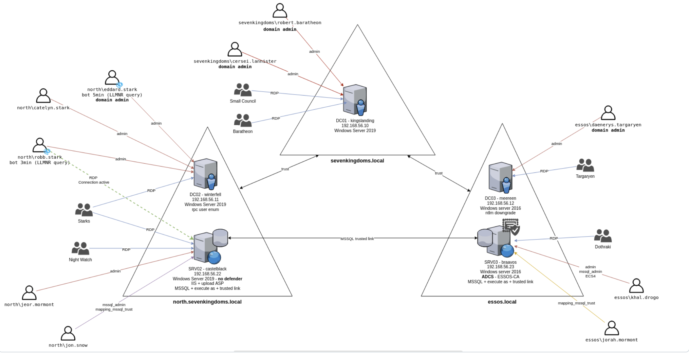
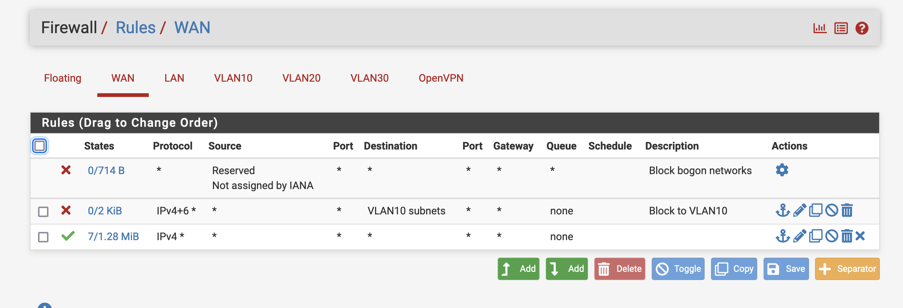
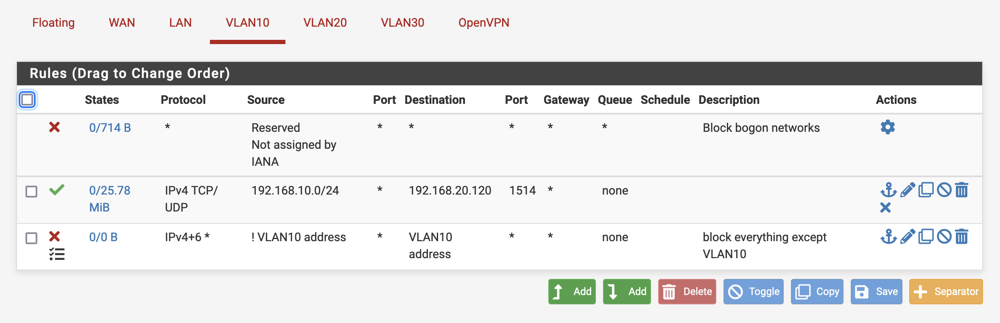

GOAD is a simulated Active Directory LAB environment used to execute Windows attacks
The purpose of this lab is to give pentesters a vulnerable Active directory environment ready to use to practice usual attack techniques. There are 5 windows servers in total, 3 domain controllers, two MySQL servers. Users and accounts have been populated and the name mimic charachters from a popular TV series. 	

Using this guide setup your GOAD LAB on your server. 

https://github.com/Orange-Cyberdefense/GOAD

Troubleshooting:

 - Use ubuntu 22.04 only - otherwise there could be issues with python3 versions 
 - SSH Troubleshooting  ssh into provisioning container change sshd.config file to accept passwords  

**Firewall rules**

WAN rules to allow traffic to any network except VLAN10:

[VLAN10] rules:
	Allow traffic out via any port to the destination port 1514 on wazuh
	Block any traffic that isn't from a VLAN address
	Allow openvpn

